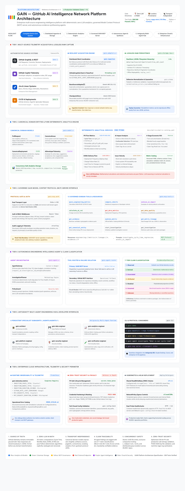

# GAIN — GitHub AI Intelligence Network

GAIN is a production-oriented Python data product for turning GitHub Pull Request telemetry into reproducible engineering-flow analytics.

## Main Features

GAIN transforms raw software engineering telemetry into verified operational intelligence, combining deterministic flow metrics with enterprise AI economic evaluation:

- **Enterprise Telemetry Ingestion & Lossless Provenance**:
  - High-throughput, distributed ingestion across 40,000+ repositories with `RedisWorkQueue` and bounded `InProcessQueue`.
  - Immutable raw JSONL capture with strict provenance metadata enabling 100% offline replayability (`replay_run()`).
  - Thread-safe GitHub App & PAT rotation with rate-limit telemetry and automatic exponential backoff (`GitHubTokenPool`).

- **Deterministic, Zero-LLM Flow & DORA Metrics**:
  - Pure Python deterministic calculations with zero LLM inference in the numerical calculation path.
  - Formal metric catalog (`docs/metrics/metric-catalog.yaml`) defining `GAIN-PR-001` (Cycle Time) through `GAIN-PR-010` (Monthly Flow).
  - Full DORA metrics suite: Deployment Frequency, Change Failure Rate (CFR), Lead Time for Changes, and Failed Deployment Recovery Time (FDRT).
  - Cross-platform issue traceability linking Jira, Linear, and GitHub commits to PR lifecycle milestones.

- **Google Cloud DORA 2026 AI ROI & Systemic Impact Engine**:
  - Implementation of the two-ledger economic framework from Google Cloud DORA (*The ROI of AI-assisted Software Development*, 2026).
  - **Investment Ledger**: Direct hard costs (licenses, tokens, training/enablement, infrastructure) plus explicit **J-Curve tuition cost** (planned adoption dip).
  - **Value Ledger**: **Reclaimed headcount capacity** (net of verification tax), **accelerated feature optionality revenue**, and the **instability tax** (downtime risk from $\Delta\text{CFR}$).
  - Asymmetric sensitivity scenarios (Conservative, Expected, Optimistic) and empirical **Verification Tax** cohort analysis.

- **Governed Model Context Protocol (MCP) Server**:
  - Production MCP Server (SDK v2, protocol `2026-07-28`) with dual transport (Streamable HTTP / SSE and `stdio`).
  - 12 governed, read-only analytical tools and versioned resources (`gain://metrics/...`, `gain://lineage/...`).
  - Enterprise security perimeter with Bearer authentication, granular RBAC (`Scope.METRICS_READ`, `Scope.INVESTIGATE`, `Scope.ADMIN`), and sliding-window rate limiting.

- **Autonomous Intelligence Agent with 7-Tier Claim Classification**:
  - Structured investigation planning (`AgentGateway`, `InvestigationPlanner`) with prompt-injection defense (`PolicyGuard`).
  - Epistemic rigor with 7-tier claim classification: `Observed`, `Derived`, `Associated`, `Attributed`, `Modeled`, `Assumed`, `Unknown`.
  - Cryptographically verifiable evidence packages backing every synthetic insight.

- **Enterprise Concurrency, Security & Observability**:
  - Atomic POSIX temporary file replacement (`UUID.tmp`) and `.compaction.lock` mutexes guaranteeing race-free storage and compaction.
  - Ephemeral 256-bit PII salt, POSIX 0600 key permissions, and automatic regex token scrubbing in structured logs.
  - Embedded Prometheus runtime metrics (`INGESTION_PAGES_TOTAL`, `GITHUB_RATE_LIMIT_REMAINING`, `MCP_REQUESTS_TOTAL`, etc.) and operational error runbooks.
  - Unified operator CLI (`gain backfill`, `gain dora`, `gain ai-roi`, `gain ai-impact`, `gain agent`, `gain mcp`).

## First implemented vertical slice

```text
GitHub GraphQL API
    -> authenticated paginated PR collection
    -> raw JSONL + provenance
    -> canonical PR records
    -> GAIN-PR-001 cycle-time metric
    -> Parquet outputs + run reports
```

The implementation deliberately treats `createdAt -> mergedAt` as **observable PR lifecycle elapsed time**, not developer coding time.

## Architecture & Platform Design

The GAIN platform architecture spans six operational tiers—from multi-source raw telemetry capture to deterministic analytics, governed MCP interfaces, autonomous evidence synthesis, and enterprise cloud infrastructure:

[](docs/architecture/gain_overall_architecture.html)

> 💡 **Interactive Architecture Visualizer**: Open [`docs/architecture/gain_overall_architecture.html`](docs/architecture/gain_overall_architecture.html) directly in a browser to explore interactive layer highlighting, component inspect modals, and data-flow animations.

The complete system architecture and operational specifications are documented in:
* **Interactive Architecture Visualizer**: [`docs/architecture/gain_overall_architecture.html`](docs/architecture/gain_overall_architecture.html)
* **Architecture Specification**: [`docs/OVERALL_ARCHITECTURE.md`](docs/OVERALL_ARCHITECTURE.md)
* **Reference Architecture**: [`docs/REFERENCE_ARCHITECTURE.md`](docs/REFERENCE_ARCHITECTURE.md)
* **Enterprise Security Architecture**: [`docs/architecture/security.md`](docs/architecture/security.md)
* **Operational Error Catalog & Runbooks**: [`docs/errors/ERROR_CATALOG.md`](docs/errors/ERROR_CATALOG.md)

### Architectural Tiers & Operational Guarantees

As detailed in the visual diagram above, the platform operates across 6 structured tiers:

| Tier | Subsystem | Key Responsibilities & Invariants |
| :--- | :--- | :--- |
| **Tier 1** | **Multi-Source Telemetry Acquisition** | Verbatim raw capture into `RawStore` JSONL (`data/raw/...`); distributed work coordination via `RedisWorkQueue` / `InProcessQueue`; thread-safe token rotation (`GitHubTokenPool`). |
| **Tier 2** | **Canonical Domain & Analytics Engine** | Transport-independent models (`PullRequest`, `CanonicalIssue`, `CanonicalDeployment`, `AiDeveloperTelemetry`); concurrency-safe atomic Parquet writes (`.tmp.<uuid>`); deterministic pure Python metric engines (`GAIN-PR-001`, `GAIN-PR-010`, DORA, AI ROI). |
| **Tier 3** | **Governed GAIN MCP Server** | Dual transport (`stdio` & Streamable HTTP / SSE); Bearer token auth, RBAC & rate limiting; 12 governed read-only analytical tools and versioned resources. |
| **Tier 4** | **Autonomous Intelligence Agent** | `AgentGateway`, `InvestigationPlanner`, `PolicyGuard` prompt defense; primary GAIN MCP routing with circuit breaker; 7-tier claim classification (`Observed`, `Derived`, `Associated`, `Attributed`, `Modeled`, `Assumed`, `Unknown`). |
| **Tier 5** | **Antigravity Multi-Agent Hub** | 6 persistent specialist subagents (`gain-architect`, `gain-data-engineer`, `gain-analytics-engineer`, `gain-platform-engineer`, `gain-security-engineer`, `gain-verification-engineer`); unified `gain` operator CLI. |
| **Tier 6** | **Enterprise Cloud & Security** | Embedded Prometheus metrics registry; operational error runbooks; ephemeral 256-bit PII salt, POSIX 0600 key files, token redactors; production Kubernetes Helm charts with RWX shared storage (`efs-sc`). |

#### Core Architectural Guarantees
1. **Source of Truth**: Observable GitHub telemetry remains immutable ground truth. Raw API responses are stored losslessly in JSONL format before transformation for offline replayability (`replay_run()`).
2. **Zero-LLM in Math**: All metric computations are pure Python deterministic algorithms cataloged in `docs/metrics/metric-catalog.yaml`. LLM reasoning in numerical calculation is strictly forbidden.
3. **Transport Independence**: Canonical domain models (`gain.model.*`) expose zero GraphQL transport artifacts (cursors, pageInfo, edges).
4. **Claim Traceability**: Every agent synthesis assertion is tagged with an explicit claim classification backed by verifiable evidence packages.
5. **Concurrency Safety**: Race-free atomic UUID temporary writes, `.compaction.lock` mutex protection, and distributed queue isolation across 40,000+ repositories.
6. **Zero-Trust Security**: Ephemeral 256-bit PII salt in non-production, `>=16`-character high-entropy salt enforcement in production, POSIX 0600 key permissions, and automatic regex token scrubbing.

### Core Subsystems

- `gain.ingestion` — distributed work queue coordination (`RedisWorkQueue`, `InProcessQueue`, `create_work_queue` factory).
- `gain.adapters` — enterprise source adapters (Jira, Linear, CI/CD deployments).
- `gain.github` — GraphQL/REST transport, retries, thread-safe token rotation (`GitHubTokenPool`), rate-limit telemetry.
- `gain.sync` — backfill orchestration and atomic checkpointing.
- `gain.storage` — replayable raw payloads (`RawStore`), concurrency-safe atomic Parquet writes (`UUID.tmp`), and `.compaction.lock` partition compaction.
- `gain.model` — transport-independent canonical domain models (`PullRequest`, `CanonicalIssue`, `CanonicalDeployment`, `CanonicalCommit`, `AiDeveloperTelemetry`).
- `gain.metrics` & `gain.services` — deterministic zero-LLM analytics engines (PR Cycle Time, Monthly Flow, AI Impact, 4-Stage AI ROI, DORA, Issue Velocity).
- `gain.telemetry` — embedded Prometheus metrics registry (`INGESTION_PAGES_TOTAL`, `GITHUB_RATE_LIMIT_REMAINING`, `MCP_REQUESTS_TOTAL`, etc.).
- `gain.mcp` — governed Model Context Protocol (MCP) server over Streamable HTTP and Stdio.
- `gain.agent` — autonomous Engineering Intelligence Agent with 7-tier claim classification.
- `gain.quality` — canonical data-quality validation.
- `gain.cli` — unified operator CLI (`gain demo`, `gain backfill`, `gain dora`, `gain issues`, `gain agent`, `gain mcp`, `gain config-check`).

## Requirements → Jira → SDD

GAIN includes a separate upstream requirements-engineering layer. It does not alter or depend on
the GitHub telemetry pipeline.

```text
Business Context → AI Story Draft → Human Validation → Approved Story
                                                      ├→ Jira (optional)
                                                      └→ SDD Specification Seed → Spec Kit workflow
```

AI output is always a non-authoritative draft. A named human must approve a validated story before
Jira export or promotion to an SDD seed. See
[the requirements/Jira/SDD architecture](docs/architecture/requirements-jira-sdd.md) and
[the feature specification](specs/002-requirements-jira-sdd/README.md).

## Quick start

Requirements: Python 3.12+, a GitHub token with access to the repositories being analyzed, and `uv`.

```bash
uv venv
source .venv/bin/activate
uv pip install -e '.[dev]'
cp .env.example .env
# edit .env; never commit secrets

# Validate configuration
 gain config-check

# Backfill configured repositories
 gain backfill

# Compute metrics from the canonical dataset
 gain compute
```

The default output directory is `./data` and can be changed through environment variables.

## Live Demo: Spinnaker PR Analytics

GAIN provides an end-to-end live demonstration script ([`scripts/demo_live.py`](scripts/demo_live.py)) that connects directly to the GitHub GraphQL API, ingests real-time pull requests from a live repository, normalizes them into canonical domain models, validates data quality, and outputs both **GAIN-PR-001** cycle-time percentiles and **GAIN-PR-010** monthly flow statistics.

### 1. Run the Live Demo Script against Spinnaker

```bash
# Provide your GitHub token (or authenticate via `gh auth login`)
export GITHUB_TOKEN=$(gh auth token)

# Run live PR telemetry analytics against firmsoil/spinnaker
python scripts/demo_live.py --repo firmsoil/spinnaker --months 2
```

### 2. Live Demo Pipeline Stages

Executing `scripts/demo_live.py` runs the complete 4-tier pipeline against live GitHub GraphQL endpoints:

1. **Live GraphQL Ingestion**: Queries GitHub's `repository.pullRequests` connection with cursor-based pagination and archives raw JSONL payloads with ingestion metadata into `data/raw/live-spinnaker-<timestamp>/`.
2. **Canonical Normalization & Quality Checks**: Maps raw records to typed `gain.model.pr.PullRequest` models, ensuring UTC normalization, and verifies invariants (`merged_at >= created_at`, valid state `OPEN`/`CLOSED`/`MERGED`).
3. **GAIN-PR-001 Cycle Time Computation**: Evaluates observable PR duration from `created_at` to `merged_at` across percentiles (`p50`, `p75`, `p90`, `p95`).
4. **GAIN-PR-010 Monthly Flow Statistics**: Generates tabular balance sheets across trailing months:

```text
Month   | Created |  Merged |  Closed | Unmerged | Merge Rate
--------+---------+---------+---------+----------+-----------
2026-08 |       0 |       0 |       0 |        0 |        N/A
2026-09 |       2 |       1 |       1 |        0 |     100.0%
--------+---------+---------+---------+----------+-----------
TOTAL   |       2 |       1 |       1 |        0 |     100.0%
```

### 3. Alternative: Running via the GAIN CLI

You can also run the individual pipeline commands manually:

```bash
# Configure repository and date window
export GITHUB_TOKEN=$(gh auth token)
export GAIN_GITHUB_REPOS="firmsoil/spinnaker"
export GAIN_START_AT="2026-07-01T00:00:00Z"
export GAIN_END_AT="2026-09-15T00:00:00Z"

# 1. Backfill live pull requests from GitHub GraphQL
gain backfill

# 2. Normalize raw ingestion into canonical Parquet
gain normalize --run-id <run_id>

# 3. Compute cycle time metrics
gain compute --canonical-path data/canonical/pull_requests__<run_id>.parquet

# 4. Generate monthly created, merged, and closed flow statistics
gain monthly-stats --canonical-path data/canonical/pull_requests__<run_id>.parquet
```

> **Offline Demo**: For offline or CI environments without a live GitHub token or network connection, run `python scripts/demo_offline.py` to execute against synthetic pre-recorded fixtures.

## Tests & Verification

The test suite validates contract interfaces, failure handling, concurrency safety, telemetry emission, and end-to-end analytical pipelines:

```bash
# Run complete test suite (310 unit, integration, and contract tests)
pytest

# Verify code style and formatting
ruff check src tests
ruff format --check src tests

# Strict type safety verification (193 source files, 0 errors)
mypy src tests --strict
```

## GAIN Model Context Protocol (MCP) Server

Phase 6 introduces the production-quality **GAIN MCP Server** (`src/gain/mcp`), exposing GAIN's trusted analytical capabilities to external AI agents and orchestrators through the official Model Context Protocol (SDK v2, protocol `2026-07-28`).

### Core Architectural Principle

GAIN MCP is strictly an **interface/access layer** over GAIN domain services. It is **NOT** a data plane, ingestion pipeline, generic SQL executor, GitHub API proxy, or LLM reasoning engine.

```text
            External AI Agents
                   │
                   ▼
             GAIN MCP Server (Interface Boundary)
                   │
                   ▼
          GAIN Domain Services
                   │
    ┌──────────────┼──────────────┐
    ▼              ▼              ▼
 Metrics        Evidence       Lineage
    │              │              │
    └──────────────┼──────────────┘
                   │
                   ▼
            GAIN Data Product
```

### Supported Transports

1. **Local CLI / Development (`stdio`)**:
   ```bash
   gain mcp --transport stdio
   ```
2. **Production Service (`Streamable HTTP`)**:
   ```bash
   gain mcp --transport streamable-http --host 127.0.0.1 --port 8000 --path /mcp
   ```
3. **MCP Inspector Interactive Validation**:
   ```bash
   .venv/bin/mcp dev src/gain/mcp/server/app.py:server
   ```

### Domain Tool Catalog (12 Tools)

| Tool Name | Scope Required | Description |
| :--- | :--- | :--- |
| `get_dora_metrics` | `gain:metrics:read` | Evaluates DORA metrics; returns explicit data gap requirements for missing deployment telemetry. |
| `query_engineering_metrics` | `gain:metrics:read` | Deterministically executes approved metrics (`pr_cycle_time`, `monthly_pr_flow_summary`). |
| `compare_cohorts` | `gain:metrics:read` | Computes statistical deltas across repository or team cohorts. |
| `analyze_ai_impact` | `gain:metrics:read` | Governed AI impact taxonomy (Observed vs Derived vs Modeled); reports insufficient data safely. |
| `calculate_ai_roi` | `gain:metrics:read` | Modeled economic scenario analysis with explicit cost and sensitivity assumptions. |
| `explain_metric` | `gain:metrics:read` | Retrieves authoritative metric definition and formula from Metric Catalog. |
| `get_metric_lineage` | `gain:metrics:read` | Traverses end-to-end lineage from observation to canonical PR and raw JSONL payload. |
| `get_evidence` | `gain:evidence:read` | Retrieves structured, auditable evidence packages by ID. |
| `start_investigation` | `gain:investigation:write` | Creates durable, application-owned investigation records independent of MCP session state. |
| `get_investigation` | `gain:investigation:read` | Retrieves investigation status with strict tenant isolation. |
| `get_data_quality` | `gain:quality:read` | Reports freshness, completeness, validity scores, and data quality flags. |
| `get_canonical_entity` | `gain:entity:read` | Retrieves canonical `PullRequest` representation by authorized identifier. |

### Addressable MCP Resources

- `gain://metric-definitions/{metric_id}/{version}` — Metric definition from catalog.
- `gain://metrics/{metric_id}` — Current summary distribution for a metric.
- `gain://cohorts/{cohort_id}` — Cohort summary.
- `gain://evidence/{evidence_id}` — Structured evidence package.
- `gain://investigations/{investigation_id}` — Durable investigation state.
- `gain://lineage/{target_id}` — Provenance and data pipeline trace.
- `gain://data-quality/{dataset_id}` — Dataset health, freshness, and validity.
- `gain://contracts/{contract_id}` — Public metric and interface contracts.

### Methodological MCP Prompts

- `dora-executive-brief` — Executive briefing on DORA engineering metrics and delivery flow.
- `dora-investigation` — Investigation into delivery lead time and deployment anomalies.
- `ai-impact-investigation` — Framework for evaluating engineering differences across cohorts.
- `ai-roi-analysis` — Economic ROI scenario analysis with explicit assumptions.
- `metric-change-investigation` — Root-cause inquiry into sudden metric shifts.
- `repository-engineering-investigation` — Holistic repository engineering flow analysis.
- `evidence-review` — Claim integrity review and evidence package audit.
- `engineering-health-briefing` — Cross-repository flow and health synthesis.

### Python Client Integration Example (MCP SDK v2)

```python
import anyio
from mcp.client.session import ClientSession
from mcp.client.streamable_http import streamable_http_client

async def query_gain_mcp() -> None:
    async with streamable_http_client("http://127.0.0.1:8000/mcp") as (read_stream, write_stream):
        async with ClientSession(read_stream, write_stream) as session:
            await session.initialize()
            
            # 1. Discover tools
            tools = await session.list_tools()
            print(f"Available tools: {[t.name for t in tools.tools]}")
            
            # 2. Query PR cycle time
            result = await session.call_tool(
                "query_engineering_metrics",
                {"metric_name": "pr_cycle_time", "repository": "firmsoil/gain"}
            )
            print("Cycle Time Result:", result.structured_content)

anyio.run(query_gain_mcp)
```

## Enterprise Cloud Deployment (Kubernetes & Helm)

GAIN provides enterprise-grade Helm charts (`deploy/helm/gain`) configured for large-scale production deployments (40,000+ repositories):

- **Distributed Storage Volume**: Uses `storageClass: "efs-sc"` (AWS EFS / Azure Files / GCP Filestore) supporting `ReadWriteMany` (RWX) for shared raw JSONL and Parquet access across distributed worker pods.
- **Configurable Network Egress**: Governed by Kubernetes NetworkPolicies with configurable internal egress (`.Values.networkPolicy.egress.allowedCIDRs`) for forward proxies, Redis work queues, and database connections.
- **Container Health Probes**: Dual-probe compatibility supporting HTTP `/healthz` for MCP servers and fallback to `gain config-check` for batch workers.
- **Fail-Closed Configuration Validation**: Run `gain config-check` to validate environment flags, queue backends, and production cryptographic secrets.

## Enterprise Security Posture

GAIN enforces strict security invariants across all operational tiers (detailed in [`docs/architecture/security.md`](docs/architecture/security.md)):

- **Zero Hardcoded Secrets**: Static default salts are eliminated; non-production environments use ephemeral 256-bit random salts (`secrets.token_bytes(32)`), and production requires explicit `GAIN_PII_SALT` with `>=16` characters and high entropy.
- **Credential Protection**: GitHub App private keys require strict POSIX file permissions (`0600`), and PAT tokens are safely masked as `pat-***`.
- **Telemetry Redaction**: Structlog automatically scrubs known sensitive keys (`private_key`, `key_pem`, `certificate`) and uses regex redactors for GitHub tokens (`ghp_`, `ghs_`, `github_pat_`).
- **Token Rotation Safety**: `GitHubTokenPool` synchronizes token rotation across concurrent async/threaded workers using `threading.Lock`.
- **PolicyGuard Defenses**: AI agent interactions enforce read-only execution boundaries and detect prompt injection attempts before tool dispatch.


