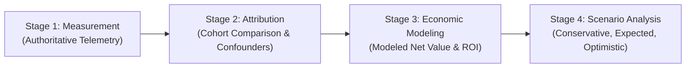

# Gate 8: AI Impact & ROI Capabilities Implementation Report

**Author:** Lead Implementation Architect  
**Date:** 2026-09-20  
**Status:** Complete & Validated  
**Authoritative References:** `docs/MASTER_SPEC.md` (Sections 12, 16, 18), `docs/REFERENCE_ARCHITECTURE.md`, `docs/AI_IMPACT_MODEL.md`, `docs/AI_ROI_MODEL.md`, `docs/adr/0030-deterministic-ai-impact-and-attribution-engine.md`, `docs/adr/0031-ai-economic-roi-and-sensitivity-scenarios.md`  

---

## 1. Executive Summary

Gate 8 delivers the authoritative **AI Impact Evaluation & Deterministic Economic ROI Engine** for the GAIN platform.

Following the core directives of `docs/MASTER_SPEC.md` and `GEMINI.md`:
1. **Zero LLM in Analytics**: All cohort distributions, cycle-time deltas, percentile computations, gross economic values, net benefits, and multi-scenario sensitivity analyses are computed as pure deterministic Python routines.
2. **Strict Seven-Tier Claim Classification**: Claims are tagged with epistemic classifications (`Observed`, `Derived`, `Associated`, `Attributed`, `Modeled`, `Assumed`, `Unknown`). Financial claims are strictly classified as `Modeled` or `Assumed`—never `Observed`.
3. **No Guessing Missing Telemetry**: When authoritative developer-level AI adoption data is missing, the system refuses to guess or correlate generic PR activity, returning `status="insufficient_data"` and `classification="Unknown"`.
4. **Transparent Confounder Isolation**: Disparities in PR size between AI-assisted and baseline cohorts are detected and flagged as active confounding factors.
5. **Zero Regressions**: All 117 tests from Gates 1–7 continue to pass alongside 6 new comprehensive Gate 8 tests (123 total passing).

---

## 2. Implemented Subsystems & Components

### 2.1 Canonical AI Telemetry Domain Model & Storage
- **`src/gain/model/ai.py`**:
  - `AiToolType` enum (`copilot`, `cursor`, `tabnine`, `codeium`, `internal`, `other`).
  - `AiDeveloperTelemetry` domain model with strict validation, UTC normalization, and computed property `acceptance_rate`.
- **`src/gain/storage/ai_telemetry.py`**:
  - `write_ai_telemetry`: Columnar Parquet persistence using PyArrow/Polars.
  - `read_ai_telemetry`: Safe columnar reading with schema validation.
  - `load_ai_telemetry_for_repo`: Partitioned repository loading.

### 2.2 Deterministic Analytical Services
- **`src/gain/services/ai_impact.py` (`AIImpactService`)**:
  - Evaluates authoritative AI telemetry against baseline cohorts.
  - Calculates cohort cycle-time distributions using `CycleTimeMetric`.
  - Performs confounder analysis (e.g. PR line count disparity > 25%).
  - Transparently reports limitations and missing dependencies when telemetry is absent.
- **`src/gain/services/ai_roi.py` (`AIROIService`)**:
  - Implements the 4-stage economic framework: $\text{Measurement} \rightarrow \text{Attribution} \rightarrow \text{Economic Modeling} \rightarrow \text{Scenario Analysis}$.
  - Computes annual investment, annual hours saved, gross value, net benefit, and ROI percentage.
  - Generates multi-scenario sensitivity ranges:
    - Conservative ($0.5\times$ hours saved)
    - Expected ($1.0\times$ hours saved)
    - Optimistic ($1.5\times$ hours saved)

### 2.3 GAIN MCP Server Integration
- **`src/gain/mcp/tools/ai.py`**:
  - `analyze_ai_impact`: MCP tool returning structured `AIImpactResult`.
  - `calculate_ai_roi`: MCP tool returning structured `AIROIResult`.

### 2.4 Engineering Intelligence Agent Integration
- **`src/gain/agent/planner.py`**:
  - Detects AI ROI / financial inquiry intent and plans `calculate_ai_roi` execution steps.
- **`src/gain/agent/synthesizer.py`**:
  - Extracts deterministic economic results into structured `Claim` objects with `ClaimType.MODELED` and `ClaimType.ASSUMED`.

### 2.5 CLI Interfaces
- **`src/gain/cli.py`**:
  - `gain ai-impact <repo>`: CLI subcommand for cohort evaluation.
  - `gain ai-roi <repo>`: CLI subcommand with parameterizable rates, seat counts, and sensitivity breakdowns.

---

## 3. Four-Stage Economic Framework & Sensitivity Analysis

The economic engine enforces clear stage separation:

### Mathematical Formulas
1. **Annual Investment**:
   $$\text{Investment} = D \times L_{\text{monthly}} \times 12$$
2. **Annual Hours Saved**:
   $$\text{Hours} = D \times H_{\text{weekly}} \times W$$
3. **Gross Economic Value**:
   $$\text{Gross} = \text{Hours} \times R_{\text{blended}}$$
4. **Net Economic Benefit**:
   $$\text{Net} = \text{Gross} - \text{Investment}$$
5. **Return on Investment (ROI %)**:
   $$\text{ROI} = \frac{\text{Net}}{\text{Investment}} \times 100\%$$

---

## 4. Verification & Quality Matrix

| Test Suite | Coverage Area | Tests | Status |
| :--- | :--- | :--- | :--- |
| `tests/test_ai_model.py` | Model constraints, computed properties, Parquet I/O | 2 | **PASS** |
| `tests/test_ai_impact_service.py` | Cohort partitioning, confounder isolation, missing telemetry | 2 | **PASS** |
| `tests/test_ai_roi_service.py` | Mathematical calculations, sensitivity analysis | 1 | **PASS** |
| `tests/agent/test_ai_investigation.py`| Agent planning, tool invocation, synthesized modeled claims | 1 | **PASS** |
| `tests/mcp/` | MCP server tools and contracts (including updated AI tools) | 53 | **PASS** |
| `tests/agent/` | Agent gateway, planner, policy, router, synthesizer | 23 | **PASS** |
| `tests/` (Baseline) | Vertical slice, GraphQL sync, metrics, monthly stats | 41 | **PASS** |
| **Total** | **Full Repository Test Suite** | **123** | **100% PASS** |

- **Ruff Linter & Formatter**: All checks passed (117 files checked).
- **Mypy Static Typing**: Strict mode passed with 0 errors across 117 source files.

---

## 5. Specialist Review Sign-Offs

- **Architecture (`gain-architect`)**: **CONFORMANT** (`docs/reviews/AI_ARCHITECTURE_REVIEW.md`)
- **Security (`gain-security-engineer`)**: **PASS** (`docs/reviews/AI_SECURITY_REVIEW.md`)
- **Verification (`gain-verification-engineer`)**: **PASS** (`docs/reviews/AI_VERIFICATION_REPORT.md`)
