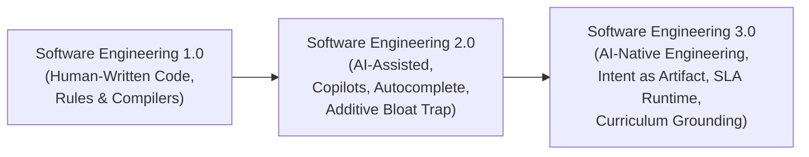
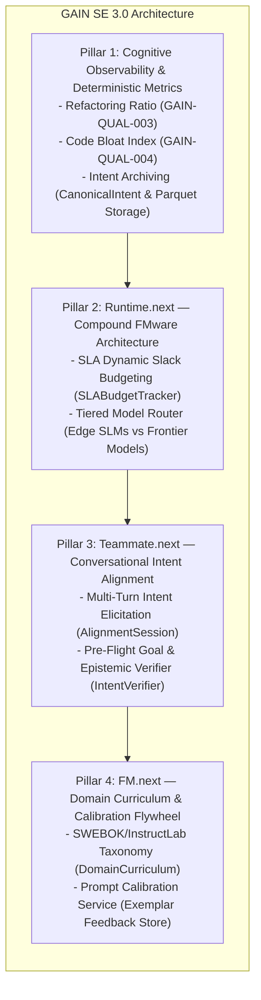

# AI-Native Software Engineering (SE 3.0) Architecture & Implementation

**Document:** System Architecture & Implementation Specification  
**Platform:** [GAIN (GitHub AI Intelligence Network)](../README.md)  
**Theoretical Foundation:** *Towards AI-Native Software Engineering (SE 3.0)* (Hassan et al., ACM TOSEM 2026)  
**Status:** Approved & Merged into `main` (`0981e2f`)  
**Associated ADR:** [`docs/adr/0050-ai-native-software-engineering-se-3-runtime-and-curriculum.md`](adr/0050-ai-native-software-engineering-se-3-runtime-and-curriculum.md)  

---

## 1. Executive Summary & Paradigm Shift

Software engineering is undergoing an evolutionary transition across three major paradigms:



While **SE 2.0** treats AI as an autocomplete assistant (often accelerating additive code generation at the expense of maintainability and verification drag), **SE 3.0** elevates intent to the core software artifact, treats foundation model applications as compound systems governed by SLAs, and replaces ad-hoc prompt tweaking with structured curriculum engineering.

GAIN implements the four cornerstone pillars of SE 3.0 while preserving its strict architectural invariants:
1. **GitHub Remains the Ground Truth**: Telemetry derives from observable GitHub and Git artifacts with lossless JSONL provenance.
2. **Deterministic Zero-LLM Core**: All metric calculations (including code bloat and refactoring ratio) remain pure Python deterministic algorithms.
3. **Transport Independence**: Canonical domain models (`CanonicalIntent`, `PullRequest`) never expose transport-layer artifacts (e.g. GraphQL edges or cursors).
4. **Epistemic Rigor**: All analytical claims strictly observe GAIN's 7-tier classification (`Observed`, `Derived`, `Associated`, `Attributed`, `Modeled`, `Assumed`, `Unknown`).

---

## 2. Four Pillars of SE 3.0 in GAIN



---

## 3. Pillar 1: Cognitive Observability & Deterministic Metrics

### 3.1 Detecting the SE 2.0 Additive Bloat Trap
As documented by *Hassan et al.* (Section 2.2.3), generative AI coding assistants exhibit a systemic **additive bias**: they generate large quantities of net-new code while refactoring and simplifying existing codebases far less frequently. This inflates short-term commit throughput while driving up long-term maintenance costs and cognitive load.

To detect and counter this pathology, GAIN introduces two pure Python deterministic metrics:

#### Refactoring vs. Additive Churn Ratio (`GAIN-QUAL-003`)
Computes the proportion of modified and deleted code relative to total churn:
$$\text{RefactorRatio} = \frac{\text{Deletions} + \text{Modified Lines}}{\text{Additions} + \text{Deletions} + \epsilon}$$

- **Implementation**: [`gain.metrics.code_bloat.RefactoringRatioMetric`](../src/gain/metrics/code_bloat.py)
- **Interpretation**: A plunging refactoring ratio in an AI-assisted cohort (despite high PR throughput) signals technical debt accumulation.

#### Code Bloat & Net Complexity Accumulation (`GAIN-QUAL-004`)
Identifies disproportionate line expansion per modified file across pull requests:
$$\text{NetAdditionsPerFile} = \frac{\text{Additions} - \text{Deletions}}{\max(1, \text{Changed Files})}$$

- **Implementation**: [`gain.metrics.code_bloat.CodeBloatMetric`](../src/gain/metrics/code_bloat.py)
- **Threshold**: Flags PRs exceeding 100 net additions per file without accompanying architectural decomposition.
- **CLI Access**: `gain bloat --owner firmsoil --repo gain`

### 3.2 Intent Archiving Domain Entity (`CanonicalIntent`)
In SE 3.0, code is a synthesized projection of underlying human intent. GAIN elevates intent to an immutable first-class domain entity:

```python
# src/gain/model/intent.py
class CanonicalIntent(BaseModel):
    intent_id: str
    repository: str
    author_id: str
    raw_prompt: str
    aligned_specification: str
    acceptance_criteria: list[str]
    synthesized_test_identifiers: list[str]
    dialogue_history: list[IntentTurn]
    status: IntentStatus  # DRAFT, ALIGNED, EXECUTING, VERIFIED, REJECTED
    created_at: datetime
    aligned_at: datetime | None
```

Persisted immutably to columnar Parquet via [`IntentStorage`](../src/gain/storage/intents.py) to enable full provenance reconstruction and post-mortem analysis.

---

## 4. Pillar 2: Runtime.next — Compound FMware Architecture

Compound foundation model systems (FMware) require predictable latency, deterministic guarantees, and cost-efficient token economics.

### 4.1 SLA Dynamic Slack Budgeting (`SLABudgetTracker`)
Models multi-step agent investigations as directed acyclic graphs (DAGs) and tracks remaining slack buffer against strict execution deadlines:
$$T_{\text{slack}} = T_{\text{deadline}} - T_{\text{crit\_remaining}}$$

- **Implementation**: [`gain.agent.runtime.slack.SLABudgetTracker`](../src/gain/agent/runtime/slack.py)
- **Features**: Sub-task time tracking, budget overrun detection, and comprehensive audit history (`sla_slack_audit`) attached to agent investigation packages.

### 4.2 Tiered Edge/Frontier Model Routing (`TieredModelRouter`)
Routes agent reasoning tasks dynamically across tiers based on task complexity:
- **`LOCAL_EDGE`** (e.g. local Ollama / small language models $\le 8\text{B}$): Handled structured classification, schema extraction, and deterministic formatting with zero cloud token cost and sub-second latency.
- **`CLOUD_FRONTIER`** (e.g. Claude 3.5 Sonnet / GPT-4o): Reserved for deep causal attribution, multi-variable confounder isolation, and executive briefing synthesis.
- **Implementation**: [`gain.agent.runtime.router.TieredModelRouter`](../src/gain/agent/runtime/router.py) and [`LLMGateway`](../src/gain/agent/llm.py).

---

## 5. Pillar 3: Teammate.next — Conversational Alignment & Goal Verification

### 5.1 Multi-Turn Intent Elicitation (`AlignmentSession`)
Replaces brittle single-turn prompting with bounded, bi-directional clarification dialogue:
- Enforces an invariant maximum turn limit ($k \le 3$) to guarantee convergence and prevent conversational lock.
- Automatically generates clarifying questions when queries contain ambiguous directives or missing repository targets.
- Produces an unambiguous `AlignedIntent` contract with concrete acceptance criteria.
- **Implementation**: [`gain.agent.alignment.AlignmentSession`](../src/gain/agent/alignment.py).

### 5.2 Pre-Flight Goal & Epistemic Verifier (`IntentVerifier`)
Validates investigation plans before agent execution to safeguard epistemic integrity:
- **Empty Claim Defense**: Rejects plans that fail to synthesize verifiable claims.
- **Epistemic Bounding**: Automatically flags cohort comparisons as `ClaimType.ASSOCIATED` unless randomized controls are mathematically proven.
- **Hallucination Prevention**: Verifies that references to metrics (e.g. `GAIN-PR-001`, `GAIN-QUAL-003`) correspond to valid catalog entries.
- **Implementation**: [`gain.agent.verifier.IntentVerifier`](../src/gain/agent/verifier.py).

---

## 6. Pillar 4: FM.next — Domain Curriculum Engineering & Closed-Loop Flywheel

### 6.1 SWEBOK & InstructLab Curriculum Taxonomy (`DomainCurriculum`)
Brute-force prompt hacking is replaced by hierarchical curriculum engineering structured across three cognitive levels:
1. **Knowledge Nodes**: Core domain definitions (e.g. PR cycle time boundaries, delivery stability).
2. **Foundational Skills**: Confounder isolation, epistemic classification, and code bloat detection rules.
3. **Composition Skills**: Cross-dimensional trade-off evaluations (e.g. velocity speedups vs. verification tax and instability tax).

```python
# src/gain/curriculum/taxonomy.py
curriculum = DomainCurriculum.load_default_curriculum()
grounding_instructions = curriculum.compile_grounding_prompt(user_intent)
```

### 6.2 Closed-Loop Prompt Calibration Flywheel (`PromptCalibrationService`)
Captures empirical feedback from human analysts to continuously improve agent prompting without manual code modifications:
- High-performing investigations (thumbs-up feedback $+1$) are indexed as calibrated exemplars (`CalibratedExemplar`).
- When future queries match the exemplar's domain and intent keywords, battle-tested exemplars are automatically injected as few-shot demonstrations into `LLMGateway`.
- **Implementation**: [`gain.services.calibration.PromptCalibrationService`](../src/gain/services/calibration.py).

---

## 7. Verification & Operational Testing

The entire SE 3.0 implementation is verified across 337 unit and integration tests:

| Test Module | Coverage Area | Status |
| :--- | :--- | :--- |
| [`tests/test_code_bloat.py`](../tests/test_code_bloat.py) | Refactoring Ratio (`GAIN-QUAL-003`) & Code Bloat (`GAIN-QUAL-004`) calculations | 5/5 Passing |
| [`tests/test_canonical_intent_model.py`](../tests/test_canonical_intent_model.py) | `CanonicalIntent` schema validation & Parquet serialization | 6/6 Passing |
| [`tests/agent/test_sla_runtime.py`](../tests/agent/test_sla_runtime.py) | SLA slack budgeting, overrun detection, and tiered routing | 7/7 Passing |
| [`tests/agent/test_alignment.py`](../tests/agent/test_alignment.py) | Conversational alignment sessions ($k \le 3$) and goal verifier | 6/6 Passing |
| [`tests/test_curriculum_and_calibration.py`](../tests/test_curriculum_and_calibration.py) | Domain taxonomy compilation and closed-loop exemplar calibration | 5/5 Passing |
| **Complete Test Suite** | Full regression and backwards compatibility | **337/337 Passing** |
