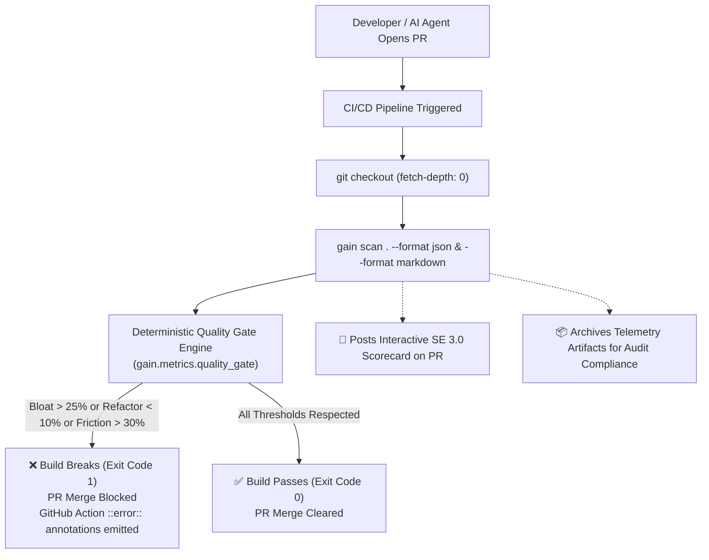

# GAIN AI-Native SE 3.0 Deterministic CI/CD Quality Gate Guide

This guide describes how to integrate GAIN into any continuous integration pipeline (GitHub Actions, GitLab CI, Jenkins, Argo Workflows) to establish an automated, deterministic **"Break-the-Build" Quality Gate**.

This workflow is designed both for **external repositories** adopting GAIN governance and for **GAIN core developers** maintaining the platform.

---

## 1. Why Deterministic Quality Gates for AI-Native Engineering?

As engineering teams adopt generative AI coding assistants (Copilot, Cursor, Claude Code, Codeium), traditional static analysis (linting, test coverage) fails to detect systemic architectural degradation identified by Hassan et al. (*Towards AI-Native Software Engineering*, ACM TOSEM 2026):

1. **The Additive Bloat Trap**: Generative assistants exhibit strong additive bias—inserting large volumes of net-new code while refactoring existing abstractions far less often.
2. **Review Fatigue (Verification Tax)**: Review queues become backlogged as reviewers face massive AI-generated pull requests lingering $>48$ hours.
3. **Fragility & Defect Churn**: Rapid generation of code without deep system context frequently induces post-merge regressions and hotfixes.

Traditional LLM-based reviewers introduce non-deterministic results, prompt hallucinations, latency bottlenecks, and token expenses. **GAIN provides a zero-token, pure Python deterministic gate** that evaluates observable Git telemetry and enforces mathematical code health thresholds before changes merge into production branches.

---

## 2. Gate Architecture & Flow



---

## 3. The 4 Deterministic Quality Gate Rules

| Metric ID | Metric Name | Catalog ID | Default Threshold | Mathematical Formula | Enforced Protection |
| :--- | :--- | :--- | :--- | :--- | :--- |
| **`GAIN-QUAL-004`** | **Code Bloat Index** | `code_bloat_index` | $\le 25.0\%$ files flagged | $\frac{\text{Additions} - \text{Deletions}}{\max(1, \text{Changed Files})} > 100$ | Prevents massive monolithic classes and files from being dumped into the codebase without modular decomposition. |
| **`GAIN-QUAL-003`** | **Refactoring Ratio** | `refactoring_vs_additive_churn_ratio` | $\ge 10.0\%$ refactoring | $\frac{\text{Deletions}}{\text{Additions} + \text{Deletions}}$ | Prevents the SE 2.0 Additive Bias Trap; ensures teams maintain and simplify existing abstractions. |
| **`GAIN-QUAL-005`** | **Verification Tax Index** | `verification_tax_index` | $\le 30.0\%$ high friction | $\frac{\text{merged\_at} - \text{created\_at}}{3600} > 48\text{h}$ | Detects review bottlenecks and cognitive fatigue before team velocity grinds to a halt. |
| **`GAIN-QUAL-006`** | **Defect Rework Rate** | `defect_rework_rate` | $\le 25.0\%$ hotfix churn | $\frac{\text{Hotfix Churn in 14-Day Window}}{\text{Total Delivery Churn}}$ | Guards against fragile code by measuring post-merge fixes, reverts, and incident hotfixes. |

---

## 4. Integration Template for Any GitHub Repository

Add the following workflow file to your repository at `.github/workflows/gain-quality-gate.yml`:

```yaml
name: "GAIN AI-Native Quality Gate"

on:
  pull_request:
    branches: [main, master, develop]
  workflow_dispatch:

permissions:
  contents: read
  pull-requests: write  # Enables automated scorecard PR comments

concurrency:
  group: ${{ github.workflow }}-${{ github.ref }}
  cancel-in-progress: true

jobs:
  gain-quality-gate:
    name: "SE 3.0 Deterministic Quality Gate"
    runs-on: ubuntu-latest

    steps:
      # Step 1: Full Git checkout (required for commit trailers and numstat churn history)
      - name: "Checkout Code"
        uses: actions/checkout@v4
        with:
          fetch-depth: 0

      # Step 2: Set up Python runtime
      - name: "Set up Python 3.12"
        uses: actions/setup-python@v5
        with:
          python-version: "3.12"
          cache: "pip"

      # Step 3: Install GAIN
      - name: "Install GAIN Governance Engine"
        run: |
          python -m pip install --upgrade pip
          pip install git+https://github.com/firmsoil/gain.git

      # Step 4: Scan working copy and extract normalized telemetry
      - name: "Scan Working Tree"
        run: |
          mkdir -p reports
          gain scan . --format json > reports/scorecard.json
          gain scan . --format markdown > reports/scorecard.md

      # Step 5: Evaluate deterministic quality gates
      - name: "Evaluate Quality Gates"
        run: |
          python - << 'EOF'
          import json
          import sys
          from gain.metrics.quality_gate import evaluate_quality_gate

          with open("reports/scorecard.json") as f:
              scorecard = json.load(f)

          # Configure your team's threshold bounds:
          result = evaluate_quality_gate(
              scorecard,
              max_bloat_pct=25.0,        # Max % of bloat-flagged files
              min_refactor_ratio=0.10,   # Min 10% refactoring churn
              max_friction_pct=30.0,     # Max % of reviews lingering >48h
              max_hotfix_pct=25.0,       # Max % of hotfix churn in 14d
              min_sample_size=5,         # Minimum PRs before ratio gates activate
          )

          print("\n" + "=" * 65)
          print("🛡️  GAIN AI-NATIVE SE 3.0 DETERMINISTIC QUALITY GATE")
          print(f"Target Repository: {scorecard.get('repository')}")
          print(f"Scan Run ID:       {scorecard.get('scan_run_id')}")
          print("=" * 65)

          if not result.passed:
              print("\n🚫 BUILD BROKEN — QUALITY GATE VIOLATIONS DETECTED:\n")
              for violation in result.violations:
                  print(f"::error title=SE 3.0 Gate Failure::{violation}")
                  print(f"   • {violation}")
              print("\n" + "=" * 65 + "\n")
              sys.exit(1)

          print("\n✅ ALL SE 3.0 QUALITY GATES PASSED")
          print(f"   • Code Bloat:     {result.bloat_percentage:.1f}% <= {result.max_bloat_threshold}%")
          print(f"   • Refactor Ratio: {result.refactoring_ratio:.1%} >= {result.min_refactoring_threshold:.1%}")
          print(f"   • Review Friction:{result.friction_percentage:.1f}% <= {result.max_friction_threshold}%")
          print(f"   • Defect Rework:  {result.hotfix_percentage:.1f}% <= {result.max_hotfix_threshold}%")
          print("=" * 65 + "\n")
          EOF

      # Step 6: Post live executive scorecard to the Pull Request
      - name: "Post Scorecard Comment on Pull Request"
        if: always() && github.event_name == 'pull_request'
        uses: actions/github-script@v7
        with:
          script: |
            const fs = require('fs');
            if (fs.existsSync('reports/scorecard.md')) {
              const body = fs.readFileSync('reports/scorecard.md', 'utf8');
              await github.rest.issues.createComment({
                issue_number: context.issue.number,
                owner: context.repo.owner,
                repo: context.repo.repo,
                body: `### 🛡️ GAIN AI-Native SE 3.0 Quality Gate\n\n${body}`
              });
            }

      # Step 7: Archive artifacts for audit and executive reporting
      - name: "Upload Scorecard Telemetry"
        if: always()
        uses: actions/upload-artifact@v4
        with:
          name: gain-se3-scorecard
          path: reports/
```

---

## 5. In-Tree Implementation for GAIN Platform Developers

For contributors working directly on the GAIN repository itself, the quality gate is natively baked into [`.github/workflows/ci.yml`](../.github/workflows/ci.yml) and supported by [`scripts/evaluate_quality_gate.py`](../scripts/evaluate_quality_gate.py):

```bash
# 1. Run local scan to produce scorecard JSON
gain scan . --format json > reports/gain_scorecard.json

# 2. Run deterministic gate evaluation
python scripts/evaluate_quality_gate.py --input reports/gain_scorecard.json

# 3. Custom threshold overrides:
python scripts/evaluate_quality_gate.py \
  --input reports/gain_scorecard.json \
  --max-bloat-pct 20.0 \
  --min-refactor-ratio 0.15 \
  --max-friction-pct 25.0 \
  --max-hotfix-pct 15.0
```

---

## 6. Programmatic Python API

You can also embed the gate directly into existing Python test suites or custom deployment pipelines:

```python
from gain.metrics.quality_gate import evaluate_quality_gate, QualityGateResult

# Given a scorecard dictionary from gain scan or MetricService:
result: QualityGateResult = evaluate_quality_gate(
    scorecard,
    max_bloat_pct=25.0,
    min_refactor_ratio=0.10,
    max_friction_pct=30.0,
    max_hotfix_pct=25.0,
)

if not result.passed:
    raise RuntimeError(f"Quality gate breached: {result.violations}")
```

---

## 7. Tuning Guidelines Across Project Lifecycles

| Project Phase | Recommended `--max-bloat-pct` | Recommended `--min-refactor-ratio` | Recommended `--max-friction-pct` | Notes |
| :--- | :--- | :--- | :--- | :--- |
| **Greenfield / Prototype** | `35.0%` | `5.0%` | `40.0%` | Permissive thresholds during initial feature scaffolding. |
| **Active Production** | `25.0%` | `10.0%` | `30.0%` | Balanced operational defaults recommended for ongoing development. |
| **Mission-Critical / Core** | `15.0%` | `20.0%` | `20.0%` | Strict discipline preventing debt accumulation in foundational platforms. |
