# GAIN Platform — Overall Architecture Specification

---

## 1. Executive Summary & Design Principles

The **GAIN (GitHub AI Intelligence Network) Platform** is an enterprise-grade engineering intelligence system designed to capture, process, and analyze engineering workflow telemetry across multi-vendor development ecosystems at Fortune 100 enterprise scale (40,000+ GitHub repositories).

The architecture strictly observes six foundational invariants:
1. **GitHub Remains Ground Truth**: Telemetry is captured losslessly in raw JSONL format before transformation, guaranteeing historical provenance and offline replayability.
2. **Deterministic, Zero-LLM Numerical Analytics**: All metric computations (Cycle Time, Monthly Flow, DORA, AI ROI) are pure Python deterministic algorithms explicitly versioned against the Metric Catalog (`docs/metrics/metric-catalog.yaml`).
3. **Transport Independence**: Canonical domain models (`gain.model.*`) expose zero GraphQL transport artifacts (cursors, edges, pageInfo).
4. **Rigorous Claim Classification**: All downstream findings produced by the Engineering Intelligence Agent are tagged with a 7-tier epistemic classification (`Observed`, `Derived`, `Associated`, `Attributed`, `Modeled`, `Assumed`, `Unknown`).
5. **Distributed Scalability & Concurrency Safety**: The ingestion pipeline distributes repository workloads across horizontally scalable worker pods via a decoupled `WorkQueue` protocol (`RedisWorkQueue` / `InProcessQueue`), thread-safe token rotation (`GitHubTokenPool`), and file-locked compaction (`.compaction.lock`).
6. **Hardened Security & Privacy Perimeter**: Zero hardcoded salts, dynamic ephemeral cryptographic salt (`secrets.token_bytes(32)`) in non-production with strict entropy checks (`>=16 chars`) in production, POSIX 0600 credential permission verification, PAT masking (`pat-***`), and real-time regex-based log sanitization.

---

## 2. Platform Architecture Visual Map

The system is organized into **six horizontal operational tiers**:

* 🔴 **Red (`#EA4335`)**: External Telemetry Endpoints & Authoritative Source Systems
* 🔵 **Blue (`#1A73E8`)**: Distributed Acquisition Engine & Canonical Domain Models
* 🟢 **Green (`#1E8E3E`)**: Lossless Storage & Concurrency-Safe Columnar Analytics (Parquet)
* 🟡 **Yellow (`#FBBC04`)**: Governed Model Context Protocol (MCP) Interface & RBAC Security Gate
* 🟣 **Purple (`#9334E8`)**: Autonomous Engineering Intelligence Agent & Evidence Synthesis Hub
* ⚪ **Slate (`#475569`)**: Enterprise Cloud Infrastructure, Telemetry & Security Perimeter (Kubernetes / Helm)

```mermaid
flowchart TD
    %% Architecture Tier Color Palette
    classDef redTier fill:#FCE8E6,stroke:#D93025,stroke-width:1.5px,color:#202124;
    classDef blueTier fill:#E8F0FE,stroke:#1A73E8,stroke-width:1.5px,color:#202124;
    classDef greenTier fill:#E6F4EA,stroke:#1E8E3E,stroke-width:1.5px,color:#202124;
    classDef yellowTier fill:#FEF7E0,stroke:#F9AB00,stroke-width:1.5px,color:#202124;
    classDef purpleTier fill:#F3E8FD,stroke:#9334E8,stroke-width:1.5px,color:#202124;
    classDef slateTier fill:#F1F5F9,stroke:#475569,stroke-width:1.5px,color:#0F172A;
    classDef greyCard fill:#FFFFFF,stroke:#DADCE0,stroke-width:1px,color:#202124;

    %% =========================================================================
    %% TIER 1: EXTERNAL SOURCES & DISTRIBUTED ACQUISITION
    %% =========================================================================
    subgraph TIER1["Tier 1: Multi-Source Telemetry Acquisition & Distributed Coordination"]
        direction TB
        subgraph Sources["External Source Systems"]
            GH_API["GitHub GraphQL & REST\n(PRs, Commits, Reviews)"]:::redTier
            COPILOT_API["GitHub Copilot API\n(Seat Telemetry, Acceptance)"]:::redTier
            JIRA_API["Jira Cloud & Linear\n(Epics, Stories, Bugs)"]:::redTier
            CICD_API["CI/CD Deployments\n(Actions, ArgoCD, Spinnaker)"]:::redTier
        end

        subgraph IngestionCoord["Distributed Work Coordination (gain.ingestion.*)"]
            QUEUE_FACTORY["create_work_queue()\n(Factory Pattern)"]:::blueTier
            REDIS_QUEUE["RedisWorkQueue\n(Distributed Multi-Pod Coordination)"]:::blueTier
            INMEM_QUEUE["InProcessQueue\n(Bounded Async Queue)"]:::blueTier
            TOKEN_POOL["GitHubTokenPool\n(threading.Lock Thread-Safe Rotation)"]:::blueTier
            WORKER_POOL["IngestionWorkerPool\n(Concurrent Scaled Execution)"]:::blueTier
        end

        subgraph Adapters["Resilient Source Adapters (gain.adapters.*)"]
            GH_CLIENT["GitHubGraphQLClient / AsyncGitHubClient\n(Backoff, Retries, Live Rate-Limit Quota Tap)"]:::blueTier
            JIRA_ADAPT["JiraSourceAdapter\n(ADF / Markdown Mapping)"]:::blueTier
            LIN_ADAPT["LinearSourceAdapter\n(State & Cycle-Time Normalization)"]:::blueTier
            DEP_ADAPT["DeploymentSourceAdapter\n(Environment, Status, Duration)"]:::blueTier
        end

        subgraph RawStoreBox["Raw Persistence (Atomic Dual-Write)"]
            RAW_JSONL[("RawStore: JSONL Tree\ndata/raw/{source}/{partition}/{run_id}.jsonl\n(Immutable Provenance Metadata)")]:::greenTier
            ERR_QUARANTINE["Normalization Quarantine\n(normalization_errors.json)"]:::greyCard
        end
    end

    %% =========================================================================
    %% TIER 2: CANONICAL DOMAIN & PERSISTENCE
    %% =========================================================================
    subgraph TIER2["Tier 2: Transport-Independent Canonical Domain & Concurrency-Safe Storage"]
        direction TB
        subgraph DomainModels["Canonical Domain Entities (Pydantic v2 Frozen)"]
            CAN_PR["PullRequest\n(UTC normalized, State machine)"]:::blueTier
            CAN_ISSUE["CanonicalIssue\n(Key, Type, Status, Points)"]:::blueTier
            CAN_DEP["CanonicalDeployment\n(Env, SHA, Status, MTTR)"]:::blueTier
            CAN_AI["AiDeveloperTelemetry\n(Dev ID, Suggestions, Accept Rate)"]:::blueTier
            CAN_COMMIT["CanonicalCommit\n(SHA, Author, Timestamps)"]:::blueTier
        end

        subgraph StorageSafety["Concurrency & Atomic Safety (gain.storage.*)"]
            ATOMIC_WRITES["Atomic Writes\n(UUID .tmp -> POSIX rename)"]:::greenTier
            COMPACTION_LOCK["Compactor\n(.compaction.lock Mutex Protection)"]:::greenTier
            CHECKPOINT_STORE["CheckpointStore\n(UUID-isolated atomic cursors)"]:::greenTier
            PARQUET_STORE[("Canonical Parquet Datasets\ndata/canonical/*.parquet\n(Partitioned, Memory-Mapped)")]:::greenTier
        end
    end

    %% =========================================================================
    %% TIER 3: DETERMINISTIC ANALYTICAL SERVICES (ZERO LLM IN MATH)
    %% =========================================================================
    subgraph TIER3["Tier 3: Deterministic Analytics Engine (Pure Python)"]
        direction TB
        CATALOG["Metric Catalog Contract\ndocs/metrics/metric-catalog.yaml\n(Versioned Definitions & Bounds)"]:::blueTier

        subgraph Services["Analytical Calculation Services"]
            PR_CYCLE["CycleTimeMetric (GAIN-PR-001)\n(merged_at - created_at, p50..p95)"]:::blueTier
            MONTHLY_STATS["MonthlyStatsMetric (GAIN-PR-010)\n(Flow Balance Sheet Accounting)"]:::blueTier
            AI_IMPACT["AIImpactService\n(Cohort Velocity Delta & Confounders)"]:::blueTier
            AI_ROI["AIROIService\n(4-Stage Economic ROI & Sensitivity)"]:::blueTier
            DORA_SVC["DORAService\n(Deployment Frequency, CFR, Lead Time)"]:::blueTier
            ISSUE_SVC["IssueAnalyticsService\n(Work Item Cycle Time & Traceability)"]:::blueTier
        end
    end

    %% =========================================================================
    %% TIER 4: GOVERNED GAIN MCP SERVER
    %% =========================================================================
    subgraph TIER4["Tier 4: Governed Model Context Protocol (MCP) Server Interface"]
        direction TB
        subgraph ProtocolGate["Security & Auth Gateway"]
            AUTH_RBAC["MCPAuthProvider & RateLimiter\n(Bearer Token, Tenant Isolation, 100 rpm)"]:::yellowTier
            TRANSPORTS["Dual Transport Protocol\n(FastMCP / Stdio & Streamable HTTP)"]:::yellowTier
        end

        subgraph ToolsBox["12 Governed Domain Tools"]
            TOOL_METRICS["query_engineering_metrics\ncompare_cohorts\nexplain_metric"]:::yellowTier
            TOOL_AI["analyze_ai_impact\ncalculate_ai_roi"]:::yellowTier
            TOOL_DORA["get_dora_metrics\nget_data_quality"]:::yellowTier
            TOOL_EVID["get_evidence\nget_metric_lineage"]:::yellowTier
        end
    end

    %% =========================================================================
    %% TIER 5: AUTONOMOUS AGENT & ANTIGRAVITY HUB
    %% =========================================================================
    subgraph TIER5["Tier 5: Autonomous Engineering Intelligence Agent & Antigravity Hub"]
        direction TB
        subgraph AgentCore["Agent Orchestrator (gain.agent.*)"]
            AGENT_GATEWAY["AgentGateway\n(Step Budgeting, Request Tracking)"]:::purpleTier
            PLANNER["InvestigationPlanner\n(Flow Health, DORA, AI ROI Plans)"]:::purpleTier
            POLICY_GUARD["PolicyGuard\n(Prompt Injection Defense, Read-Only Boundary)"]:::purpleTier
            TOOL_ROUTER["ToolRouter\n(GAIN MCP Authoritative vs GitHub Operational)"]:::purpleTier
            SYNTHESIZER["EvidenceSynthesizer\n(7-Tier Epistemic Claim Classifier)"]:::purpleTier
            LLM_GATEWAY["LLMGateway\n(Briefing Synthesis from Evidence Packages)"]:::purpleTier
        end

        subgraph AntigravityTeam["Antigravity Specialist Subagent Ecosystem"]
            ARCH_AGENT["gain-architect"]:::greyCard
            DATA_AGENT["gain-data-engineer"]:::greyCard
            ANALYTICS_AGENT["gain-analytics-engineer"]:::greyCard
            PLATFORM_AGENT["gain-platform-engineer"]:::greyCard
            SECURITY_AGENT["gain-security-engineer"]:::greyCard
            VERIFY_AGENT["gain-verification-engineer"]:::greyCard
        end

        subgraph UserInterfaces["Developer & CLI Interfaces"]
            CLI["gain CLI\n(demo, backfill, dora, issues, agent, mcp, config-check)"]:::greyCard
            IDE["Antigravity IDE & Claude Desktop"]:::greyCard
        end
    end

    %% =========================================================================
    %% TIER 6: ENTERPRISE INFRASTRUCTURE, OBSERVABILITY & SECURITY PERIMETER
    %% =========================================================================
    subgraph TIER6["Tier 6: Enterprise Cloud Infrastructure, Telemetry & Security Perimeter"]
        direction TB
        subgraph Observability["Prometheus Telemetry & Error Catalog"]
            PROM_METRICS["Runtime Telemetry (gain.telemetry.metrics)\n- INGESTION_PAGES_TOTAL\n- INGESTION_NODES_TOTAL\n- INGESTION_DURATION_SECONDS\n- GITHUB_RATE_LIMIT_REMAINING\n- MCP_REQUESTS_TOTAL\n- MCP_REQUEST_DURATION_SECONDS"]:::slateTier
            ERR_CATALOG["Error Catalog & Runbooks\n(docs/errors/ERROR_CATALOG.md)"]:::slateTier
        end

        subgraph SecurityPerimeter["Hardened Security Posture"]
            SALT_MGMT["PII Salt Management\n(Ephemeral 256-bit dev salt / >=16 char prod validation)"]:::slateTier
            AUTH_HARDENING["Credential Hardening\n(PAT masking pat-*** / 0600 key file permissions)"]:::slateTier
            LOG_REDACT["Telemetry Redaction\n(Regex TOKEN_PATTERN + SENSITIVE_KEYS)"]:::slateTier
        end

        subgraph K8sDeploy["Kubernetes / Helm Deployment (deploy/helm/gain)"]
            HELM_STORAGE["Shared ReadWriteMany Storage\n(storageClass: 'efs-sc' for RWX multi-replica)"]:::slateTier
            NET_POLICY["NetworkPolicy Egress Controls\n(Templated allowedCIDRs RFC1918 egress)"]:::slateTier
            CONTAINER_HEALTH["Resilient Dual-Probe Health\n(/healthz HTTP + fallback gain config-check)"]:::slateTier
        end
    end

    %% Connections
    Sources --> Adapters
    QUEUE_FACTORY --> REDIS_QUEUE
    QUEUE_FACTORY --> INMEM_QUEUE
    REDIS_QUEUE --> WORKER_POOL
    INMEM_QUEUE --> WORKER_POOL
    TOKEN_POOL --> GH_CLIENT
    WORKER_POOL --> Adapters

    Adapters -->|Verbatim Raw Capture| RawStoreBox
    RawStoreBox -->|Defensive Normalization| DomainModels
    DomainModels -->|Atomic UUID Serialization| StorageSafety
    StorageSafety --> Services
    CATALOG -.->|Version Enforced| Services

    Services --> ToolsBox
    ProtocolGate --> ToolsBox
    ToolsBox -->|Governed RPC| TOOL_ROUTER

    AGENT_GATEWAY --> PLANNER
    PLANNER --> POLICY_GUARD
    POLICY_GUARD --> TOOL_ROUTER
    TOOL_ROUTER --> SYNTHESIZER
    SYNTHESIZER --> LLM_GATEWAY
    LLM_GATEWAY --> UserInterfaces
    AntigravityTeam -.-> UserInterfaces

    %% Observability taps
    Adapters -.->|Quotas & Durations| Observability
    WORKER_POOL -.->|Pages & Nodes| Observability
    ProtocolGate -.->|Requests & Latencies| Observability
    SecurityPerimeter -.-> IngestionCoord
    SecurityPerimeter -.-> StorageSafety
    K8sDeploy -.-> IngestionCoord
```

---

## 3. Epistemic Claim Classification Matrix (7-Tier Taxonomy)

| Claim Classification | Definition | Example Telemetry / Metric Finding | Epistemic Source |
| :--- | :--- | :--- | :--- |
| **`Observed`** | Verbatim fact recorded in primary telemetry | 9 merged PRs out of 10 total in target repo | Raw GitHub / Jira telemetry |
| **`Derived`** | Deterministic mathematical calculation | Median PR cycle time is 23,400 seconds (6.5 hours) | Pure Python metric functions |
| **`Associated`** | Statistical correlation across cohorts | AI cohort cycle-time delta is -42.2 hours vs baseline | Cohort comparison service |
| **`Attributed`** | Causal attribution established by controlled test | "AI tool adoption caused 15% velocity gain" (Quarantined) | Requires randomized A/B test |
| **`Modeled`** | Parameterized scenario projection | Expected net annual benefit is projected at \$211,440 | 4-stage ROI sensitivity model |
| **`Assumed`** | Industry baseline or operational benchmark | Fully-loaded blended developer rate is \$85.00/hour | Model configuration parameter |
| **`Unknown`** | Telemetry missing, unindexed, or unavailable | DORA recovery MTTR when incident data is absent | Insufficient dependency error |

---

## 4. Enterprise Scale & Concurrency Architecture (40,000+ Repositories)

To support 40,000+ repositories across thousands of engineering teams in a Fortune 100 enterprise, GAIN addresses the throughput, concurrency, and reliability constraints through four core architectural upgrades:

### 4.1 Distributed Work Coordination
- **`WorkQueue` Protocol**: An asynchronous contract (`enqueue`, `dequeue`, `mark_done`, `mark_failed`, `qsize`) defining queue semantics.
- **`RedisWorkQueue`**: Production queue engine supporting cross-pod work distribution, persistent acknowledgment, and retry backoff across horizontal Kubernetes replicas.
- **`InProcessQueue`**: Local development and test queue bounded by `maxsize` to prevent unbounded memory growth.
- **Dynamic Queue Factory (`create_work_queue`)**: Automatically instantiated by `IngestionCoordinator` based on `GAIN_QUEUE_BACKEND` (`redis` vs `in_process`).

### 4.2 Concurrency-Safe Storage Engine
- **Atomic UUID File Writes**: `write_canonical()`, `write_cycle_time_observations()`, and `write_monthly_stats()` write to temporary files (`<target>.tmp.<uuid>`) before performing an atomic POSIX replace (`replace()`), guaranteeing that concurrent writes or crashed workers never produce corrupt or partially-written Parquet files.
- **Compaction Mutex Locking**: The Parquet dataset compactor (`Compactor.compact_all()`) acquires an exclusive `.compaction.lock` file before reading, rewriting, and replacing partitions, preventing race conditions between concurrent worker pods.
- **Atomic Checkpoint Management**: Checkpoint persistence in `gain.storage.checkpoint` uses unique UUID temporary files to eliminate cursor write races.

### 4.3 Thread-Safe Token Rotation
- **Multi-Token Pool Thread Safety**: `GitHubTokenPool` wraps all state mutations (`acquire_token`, `add_provider`, `report_rate_limit`) with `threading.Lock`, allowing multi-threaded and async workers to share token budgets safely without race conditions.

---

## 5. Security & Observability Posture

### 5.1 Hardened Security & Privacy Perimeter
- **Zero Hardcoded HMAC Salts**: The static default salt fallback has been eradicated. In development and testing, an ephemeral 256-bit cryptographically secure salt (`secrets.token_bytes(32)`) is generated dynamically per runtime session.
- **Production Readiness Enforcement**: In `production`/`prod` environments, `validate_production_readiness()` strictly requires an explicitly configured `GAIN_PII_SALT` with at least 16 characters and sufficient entropy.
- **Credential Protection**: Private key files for GitHub Apps must exist and possess strict POSIX permissions (no world or group read access, e.g. `0600`).
- **PAT Masking & Telemetry Redaction**: Personal Access Tokens (PATs) are masked as `pat-***` in authorization strings. The logging system applies `TOKEN_PATTERN` regex matching to scrub GitHub personal, server, and app tokens (`ghp_`, `ghs_`, `github_pat_`), alongside `SENSITIVE_KEYS` redaction for private keys and certificates.

### 5.2 Runtime Observability & Error Governance
- **Prometheus Metrics Registry**: The module-level singleton `REGISTRY` in `gain.telemetry.metrics` instruments core operational paths:
  * `INGESTION_PAGES_TOTAL` & `INGESTION_NODES_TOTAL` (ingestion volume counters)
  * `INGESTION_DURATION_SECONDS` (ingestion latency distribution)
  * `GITHUB_RATE_LIMIT_REMAINING` (live quota monitoring gauge from `x-ratelimit-remaining`)
  * `MCP_REQUESTS_TOTAL` & `MCP_REQUEST_DURATION_SECONDS` (governed interface load & latency)
- **Standardized Error Taxonomy**: The Operational Error Catalog (`docs/errors/ERROR_CATALOG.md`) defines explicit error codes, severity levels, mitigation strategies, and runbooks for all GAIN exception types.

---

## 6. Enterprise Cloud Deployment & Infrastructure (Kubernetes / Helm)

GAIN includes a production Helm chart (`deploy/helm/gain`) optimized for multi-tenant enterprise clusters:
- **Shared Storage Volume**: Configured with `storageClass: "efs-sc"` (AWS EFS / Azure Files / GCP Filestore) supporting `ReadWriteMany` (RWX) access modes for distributed ingestion worker pools sharing raw and canonical storage.
- **Configurable Network Policies**: Egress rules template `.Values.networkPolicy.egress.allowedCIDRs`, replacing rigid RFC1918 exclusions with configurable CIDR whitelisting for enterprise proxies and internal Redis clusters.
- **Dual-Probe Container Health Check**: The production container image supports dual-mode health probes (HTTP `/healthz` for long-running MCP servers, falling back to `gain config-check` for batch worker containers).

---

## 7. Verification & Quality Gates

The complete GAIN platform has been rigorously validated across all architectural gates:

* **Automated Test Suite**: **308 unit, integration, and contract tests passing** (`pytest -v`).
* **Static Type Safety**: Strict type validation (`strict = true`) passing with **0 errors across 193 source files** (`mypy src tests --strict`).
* **Linting & Code Formatting**: `ruff check` and `ruff format` passing cleanly across all repository files.
* **Vertical Slice Integrity**: End-to-end telemetry acquisition, raw capture, canonical transformation, deterministic cycle time, and monthly flow computations verified operational.
