# GAIN Platform — Overall Architecture Specification

---

## 1. Executive Summary & Design Principles

The **GAIN (GitHub AI Intelligence Network) Platform** is an enterprise-grade engineering intelligence system designed to capture, process, and analyze engineering workflow telemetry across multi-vendor development ecosystems.

The architecture strictly observes four foundational invariants:
1. **GitHub Remains Ground Truth**: Telemetry is captured losslessly in raw JSONL format before transformation.
2. **Deterministic, Zero-LLM Numerical Analytics**: All metric computations (Cycle Time, Monthly Flow, DORA, AI ROI) are pure Python deterministic algorithms explicitly versioned against the Metric Catalog (`docs/metrics/metric-catalog.yaml`).
3. **Transport Independence**: Canonical domain models (`gain.model.*`) expose zero GraphQL transport artifacts (cursors, edges, pageInfo).
4. **Rigorous Claim Classification**: All downstream findings produced by the Engineering Intelligence Agent are tagged with a 7-tier epistemic classification (`Observed`, `Derived`, `Associated`, `Attributed`, `Modeled`, `Assumed`, `Unknown`).

---

## 2. Platform Architecture Visual Map

The system is organized into **five horizontal operational tiers**:

* 🔴 **Red (`#EA4335`)**: External Telemetry Endpoints & Authoritative Source Systems
* 🔵 **Blue (`#1A73E8`)**: Acquisition Engine & Canonical Domain Models
* 🟢 **Green (`#1E8E3E`)**: Lossless Storage & Columnar Analytics Layer (Parquet)
* 🟡 **Yellow (`#FBBC04`)**: Governed Model Context Protocol (MCP) Interface & RBAC Security Gate
* 🟣 **Purple (`#9334E8`)**: Autonomous Engineering Intelligence Agent & Evidence Synthesis Hub

```mermaid
flowchart TD
    %% Architecture Tier Color Palette
    classDef redTier fill:#FCE8E6,stroke:#D93025,stroke-width:1.5px,color:#202124;
    classDef blueTier fill:#E8F0FE,stroke:#1A73E8,stroke-width:1.5px,color:#202124;
    classDef greenTier fill:#E6F4EA,stroke:#1E8E3E,stroke-width:1.5px,color:#202124;
    classDef yellowTier fill:#FEF7E0,stroke:#F9AB00,stroke-width:1.5px,color:#202124;
    classDef purpleTier fill:#F3E8FD,stroke:#9334E8,stroke-width:1.5px,color:#202124;
    classDef greyCard fill:#FFFFFF,stroke:#DADCE0,stroke-width:1px,color:#202124;

    %% =========================================================================
    %% TIER 1: EXTERNAL SOURCES & ACQUISITION
    %% =========================================================================
    subgraph TIER1["Tier 1: Multi-Source Telemetry Acquisition & Lossless Raw Store"]
        direction TB
        subgraph Sources["External Source Systems"]
            GH_API["GitHub GraphQL & REST\n(PRs, Commits, Reviews)"]:::redTier
            COPILOT_API["GitHub Copilot API\n(Seat Telemetry, Acceptance)"]:::redTier
            JIRA_API["Jira Cloud & Linear\n(Epics, Stories, Bugs)"]:::redTier
            CICD_API["CI/CD Deployments\n(Actions, ArgoCD, Spinnaker)"]:::redTier
        end

        subgraph Adapters["Resilient Source Adapters (gain.adapters.*)"]
            GH_CLIENT["GitHubGraphQLClient\n(Backoff, Retries, Rate-Limits)"]:::blueTier
            JIRA_ADAPT["JiraSourceAdapter\n(ADF / Markdown Mapping)"]:::blueTier
            LIN_ADAPT["LinearSourceAdapter\n(State & Cycle-Time Normalization)"]:::blueTier
            DEP_ADAPT["DeploymentSourceAdapter\n(Environment, Status, Duration)"]:::blueTier
        end

        subgraph RawStoreBox["Raw Persistence (Atomic Dual-Write)"]
            RAW_JSONL[("RawStore: JSONL Tree\ndata/raw/{source}/{partition}/{run_id}.jsonl\n(Immutable Provenance Metadata)")]:::greenTier
            ERR_QUARANTINE["Normalization Quarantine\n(normalization_errors.json)"]:::greyCard
        end
    end

    %% =========================================================================
    %% TIER 2: CANONICAL DOMAIN & PERSISTENCE
    %% =========================================================================
    subgraph TIER2["Tier 2: Transport-Independent Canonical Domain & Analytics Persistence"]
        direction TB
        subgraph DomainModels["Canonical Domain Entities (Pydantic v2 Frozen)"]
            CAN_PR["PullRequest\n(UTC normalized, State machine)"]:::blueTier
            CAN_ISSUE["CanonicalIssue\n(Key, Type, Status, Points)"]:::blueTier
            CAN_DEP["CanonicalDeployment\n(Env, SHA, Status, MTTR)"]:::blueTier
            CAN_AI["AiDeveloperTelemetry\n(Dev ID, Suggestions, Accept Rate)"]:::blueTier
            CAN_COMMIT["CanonicalCommit\n(SHA, Author, Timestamps)"]:::blueTier
        end

        subgraph AnalyticsStore["Columnar Storage Engine (PyArrow / Polars)"]
            PARQUET_STORE[("Canonical Parquet Datasets\ndata/canonical/*.parquet\n(Partitioned, Memory-Mapped)")]:::greenTier
        end
    end

    %% =========================================================================
    %% TIER 3: DETERMINISTIC ANALYTICAL SERVICES (ZERO LLM IN MATH)
    %% =========================================================================
    subgraph TIER3["Tier 3: Deterministic Analytics Engine (Pure Python)"]
        direction TB
        CATALOG["Metric Catalog Contract\ndocs/metrics/metric-catalog.yaml\n(Versioned Definitions & Bounds)"]:::blueTier

        subgraph Services["Analytical Calculation Services"]
            PR_CYCLE["CycleTimeMetric (GAIN-PR-001)\n(merged_at - created_at, p50..p95)"]:::blueTier
            MONTHLY_STATS["MonthlyStatsMetric (GAIN-PR-010)\n(Flow Balance Sheet Accounting)"]:::blueTier
            AI_IMPACT["AIImpactService\n(Cohort Velocity Delta & Confounders)"]:::blueTier
            AI_ROI["AIROIService\n(4-Stage Economic ROI & Sensitivity)"]:::blueTier
            DORA_SVC["DORAService\n(Deployment Frequency, CFR, Lead Time)"]:::blueTier
            ISSUE_SVC["IssueAnalyticsService\n(Work Item Cycle Time & Traceability)"]:::blueTier
        end
    end

    %% =========================================================================
    %% TIER 4: GOVERNED GAIN MCP SERVER
    %% =========================================================================
    subgraph TIER4["Tier 4: Governed Model Context Protocol (MCP) Server Interface"]
        direction TB
        subgraph ProtocolGate["Security & Auth Gateway"]
            AUTH_RBAC["MCPAuthProvider & RateLimiter\n(Bearer Token, Tenant Isolation, 100 rpm)"]:::yellowTier
            TRANSPORTS["Dual Transport Protocol\n(FastMCP / Stdio & SSE)"]:::yellowTier
        end

        subgraph ToolsBox["12 Governed Domain Tools"]
            TOOL_METRICS["query_engineering_metrics\ncompare_cohorts\nexplain_metric"]:::yellowTier
            TOOL_AI["analyze_ai_impact\ncalculate_ai_roi"]:::yellowTier
            TOOL_DORA["get_dora_metrics\nget_data_quality"]:::yellowTier
            TOOL_EVID["get_evidence\nget_metric_lineage"]:::yellowTier
        end
    end

    %% =========================================================================
    %% TIER 5: AUTONOMOUS AGENT & ANTIGRAVITY HUB
    %% =========================================================================
    subgraph TIER5["Tier 5: Autonomous Engineering Intelligence Agent & Antigravity Hub"]
        direction TB
        subgraph AgentCore["Agent Orchestrator (gain.agent.*)"]
            AGENT_GATEWAY["AgentGateway\n(Step Budgeting, Request Tracking)"]:::purpleTier
            PLANNER["InvestigationPlanner\n(Flow Health, DORA, AI ROI Plans)"]:::purpleTier
            POLICY_GUARD["PolicyGuard\n(Prompt Injection Defense, Read-Only Boundary)"]:::purpleTier
            TOOL_ROUTER["ToolRouter\n(GAIN MCP Authoritative vs GitHub Operational)"]:::purpleTier
            SYNTHESIZER["EvidenceSynthesizer\n(7-Tier Epistemic Claim Classifier)"]:::purpleTier
            LLM_GATEWAY["LLMGateway\n(Briefing Synthesis from Evidence Packages)"]:::purpleTier
        end

        subgraph AntigravityTeam["Antigravity Specialist Subagent Ecosystem"]
            ARCH_AGENT["gain-architect"]:::greyCard
            DATA_AGENT["gain-data-engineer"]:::greyCard
            ANALYTICS_AGENT["gain-analytics-engineer"]:::greyCard
            PLATFORM_AGENT["gain-platform-engineer"]:::greyCard
            SECURITY_AGENT["gain-security-engineer"]:::greyCard
            VERIFY_AGENT["gain-verification-engineer"]:::greyCard
        end

        subgraph UserInterfaces["Developer & CLI Interfaces"]
            CLI["gain CLI\n(demo, backfill, dora, issues, agent, mcp)"]:::greyCard
            IDE["Antigravity IDE & Claude Desktop"]:::greyCard
        end
    end

    %% Connections
    Sources --> Adapters
    Adapters -->|Verbatim Raw Capture| RawStoreBox
    RawStoreBox -->|Defensive Normalization| DomainModels
    DomainModels -->|Columnar Serialization| AnalyticsStore
    AnalyticsStore --> Services
    CATALOG -.->|Version Enforced| Services

    Services --> ToolsBox
    ProtocolGate --> ToolsBox
    ToolsBox -->|Governed RPC| TOOL_ROUTER

    AGENT_GATEWAY --> PLANNER
    PLANNER --> POLICY_GUARD
    POLICY_GUARD --> TOOL_ROUTER
    TOOL_ROUTER --> SYNTHESIZER
    SYNTHESIZER --> LLM_GATEWAY
    LLM_GATEWAY --> UserInterfaces
    AntigravityTeam -.-> UserInterfaces
```

---

## 3. Epistemic Claim Classification Matrix (7-Tier Taxonomy)

| Claim Classification | Definition | Example Telemetry / Metric Finding | Epistemic Source |
| :--- | :--- | :--- | :--- |
| **`Observed`** | Verbatim fact recorded in primary telemetry | 9 merged PRs out of 10 total in target repo | Raw GitHub / Jira telemetry |
| **`Derived`** | Deterministic mathematical calculation | Median PR cycle time is 23,400 seconds (6.5 hours) | Pure Python metric functions |
| **`Associated`** | Statistical correlation across cohorts | AI cohort cycle-time delta is -42.2 hours vs baseline | Cohort comparison service |
| **`Attributed`** | Causal attribution established by controlled test | "AI tool adoption caused 15% velocity gain" (Quarantined) | Requires randomized A/B test |
| **`Modeled`** | Parameterized scenario projection | Expected net annual benefit is projected at \$211,440 | 4-stage ROI sensitivity model |
| **`Assumed`** | Industry baseline or operational benchmark | Fully-loaded blended developer rate is \$85.00/hour | Model configuration parameter |
| **`Unknown`** | Telemetry missing, unindexed, or unavailable | DORA recovery MTTR when incident data is absent | Insufficient dependency error |

---

## 4. Verification & Quality Gates

The complete GAIN platform has been rigorously validated across all architectural gates:

* **Automated Test Suite**: 135 unit, integration, and contract tests passing (`pytest -v`).
* **Static Type Safety**: `mypy src tests scripts/demo_gain_platform.py` passing in strict mode (`strict = true`, 0 errors across 137 source files).
* **Linting & Code Standards**: `ruff check` and `ruff format` passing cleanly across all 140 files.
* **Master Demo Execution**: Verified operational via `gain demo` and `.venv/bin/python scripts/demo_gain_platform.py`.
