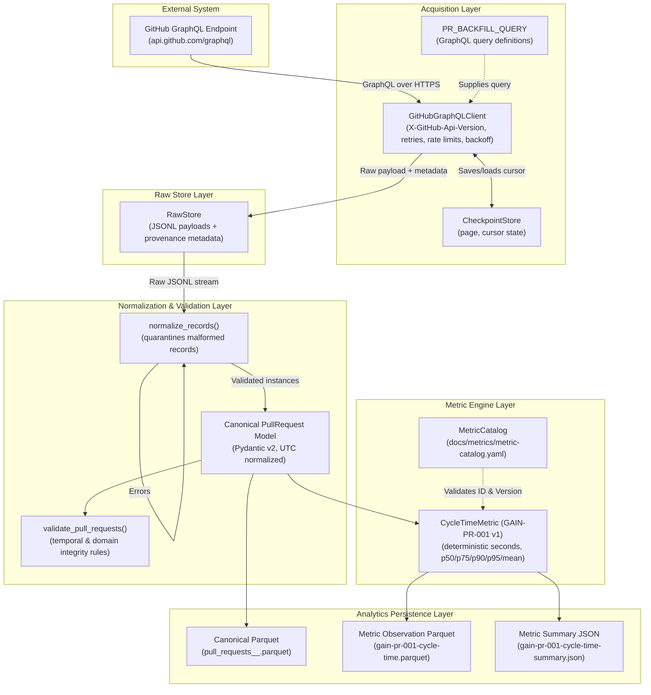

# GAIN Reference Architecture — Production Vertical Slice 1

## 1. System Mission & Context

GAIN (GitHub AI Intelligence Network) extracts GitHub engineering flow activity and produces high-integrity, deterministic, versioned metrics for engineering leadership and developer productivity analysis.

> [!NOTE]
> For the complete multi-tier enterprise architecture across all platform capabilities (telemetry adapters, canonical models, deterministic metrics, MCP server, autonomous agent, and interactive diagram), see [`docs/OVERALL_ARCHITECTURE.md`](OVERALL_ARCHITECTURE.md) and [`docs/architecture/gain_overall_architecture.html`](architecture/gain_overall_architecture.html).

This document defines the **first production vertical slice** of the GAIN system:
```
GitHub GraphQL API
      │
      ▼
 Acquisition (resilient client, auth, pagination, rate limits, retries)
      │
      ▼
 Raw API Capture (lossless JSONL with provenance metadata)
      │
      ▼
 Validation & Schema Normalization (Pydantic model, UTC enforcement, error quarantine)
      │
      ▼
 Canonical PullRequest Entity (transport-independent domain representation)
      │
      ▼
 Deterministic Metric Engine (pure Python, versioned catalog, zero LLM dependencies)
      │
      ▼
 Persisted Metric Observations (Parquet / JSON analytics store)
      │
      ▼
 Automated Tests & Telemetry (contract tests, unit tests, end-to-end integration, structured logging)
```

---

## 2. Core Architectural Principles & Required Constraints

1. **GitHub Remains the Source of Truth**  
   All metrics derive strictly from observable GitHub engineering artifacts. The system stores unaltered raw payloads, ensuring that downstream metric calculations, re-aggregations, or revisions never alter or misrepresent upstream ground truth.

2. **Lossless Raw Capture with Provenance & Replayability**  
   Every payload fetched from GitHub is persisted verbatim in JSONL format prior to any domain normalization. Each raw node is encapsulated alongside immutable provenance metadata:
   - Ingestion Run ID (`ingestion_run_id`)
   - Repository Identification (`repository_id`, `repository_name_with_owner`)
   - Traversal Coordinates (`page_number`, `cursor`)
   - Ingestion Timestamp in UTC (`collected_at`)  
   Replay runs (`gain.storage.replay.replay_run`) allow reprocessing, testing new metric algorithms, and auditing without generating external API calls to GitHub.

3. **Transport-Independent Canonical Domain Model**  
   The domain model (`gain.model.pr.PullRequest`) is strictly decoupled from GitHub GraphQL transport topologies (connections, edges, cursors, GraphQL wrappers). The canonical model validates constraints (e.g. valid lifecycle states, positive file/line counts, timezone normalization) independently of the transport protocol.

4. **Deterministic, Zero-LLM Metric Engine**  
   Cycle time (`GAIN-PR-001`) is computed through pure, deterministic mathematical operations:
   $$\text{CycleTime} = \text{merged\_at} - \text{created\_at}$$
   The metric engine is explicitly versioned against the machine-readable Metric Catalog (`docs/metrics/metric-catalog.yaml`). **No LLM reasoning, heuristic guessing, or probabilistic inference is permitted in metric calculation.**

5. **Explicit Handling of Malformed or Incomplete Data**  
   Incomplete, malformed, or corrupt source records are quarantined and captured as structured errors with exact record indices and error descriptions. Normalization fails safely without crashing entire ingestion runs or corrupting aggregate metrics.

6. **Strict Negative Scope (Non-Goals for Slice 1)**  
   The following components are explicitly excluded from this vertical slice:
   - LLM agents or autonomous coding assistants
   - GitHub Model Context Protocol (MCP) or GAIN MCP servers
   - AI attribution or AI ROI modeling
   - Web user interfaces or interactive visualization dashboards
   - Upstream Jira synchronization or requirements generation

---

## 3. Component Architecture & Boundaries



### 3.1 GitHub Client Specifications
- **API Version Tracking**: Explicitly sends `X-GitHub-Api-Version: 2022-11-28`.
- **Pagination**: Traverses cursor-based connections (`after: $cursor`) ordered by `CREATED_AT DESC`, terminating gracefully when crossing the configured date boundary (`since`).
- **Resilience & Backoff**: Exponential backoff with jitter ceiling (`base_backoff_seconds`, `retry_max_backoff_seconds`), handling HTTP 403, 429, 5xx, and network timeouts. Respects `retry-after` and `x-ratelimit-reset` headers.
- **Checkpointing**: Ingestion runs can persist and reload pagination cursors per repository, supporting interruption and resumption.

### 3.2 Canonical PullRequest Entity
`PullRequest` is an immutable, validated domain entity (`pydantic.BaseModel`):
- `github_node_id: str`
- `number: int` (greater than 0)
- `repository_name_with_owner: str`
- `repository_id: str`
- `author_login: str | None`
- `author_type: str | None`
- `created_at: datetime` (UTC)
- `closed_at: datetime | None` (UTC)
- `merged_at: datetime | None` (UTC)
- `state: str` (`OPEN`, `CLOSED`, `MERGED`)
- `is_draft: bool`
- `additions: int | None`
- `deletions: int | None`
- `changed_files: int | None`
- `review_decision: str | None`
- `collected_at: datetime` (UTC)
- `ingestion_run_id: str`

### 3.3 Metric Specification: GAIN-PR-001
- **Catalog ID**: `GAIN-PR-001`
- **Version**: `1`
- **Name**: `pr_cycle_time`
- **Formula**: `merged_at - created_at`
- **Unit**: Seconds (duration)
- **Null Policy**: Exclude unmerged PRs (`merged_at is None`) from cycle-time calculations.
- **Aggregations**: Count, p50, p75, p90, p95, arithmetic mean.
- **Analytical Guardrail**: Cycle time represents observable elapsed lifecycle time from PR creation to merge. It must not be characterized as individual coding time or developer effort.

---

## 4. Extensibility to Additional GitHub Entities

The architecture is explicitly designed to ingest and analyze additional GitHub entities (e.g. Issues, Commits, Reviews, Releases, Deployments) by replicating the same decoupled pipeline pattern:
1. **GraphQL Query**: Define entity-specific queries in `gain.github.queries` (e.g. `ISSUE_BACKFILL_QUERY`, `REVIEW_BACKFILL_QUERY`).
2. **Raw Capture**: Use `RawStore.append_page` without modification; the raw storage engine is entity-agnostic.
3. **Canonical Model**: Implement entity Pydantic domain models in `gain.model.<entity>.py` (e.g. `Issue`, `PullRequestReview`).
4. **Schema Normalization**: Implement `normalize_raw_<entity>_record` in `gain.schema`.
5. **Metric Engine**: Register new versioned metrics in `docs/metrics/metric-catalog.yaml` and implement corresponding calculation classes in `gain.metrics`.
