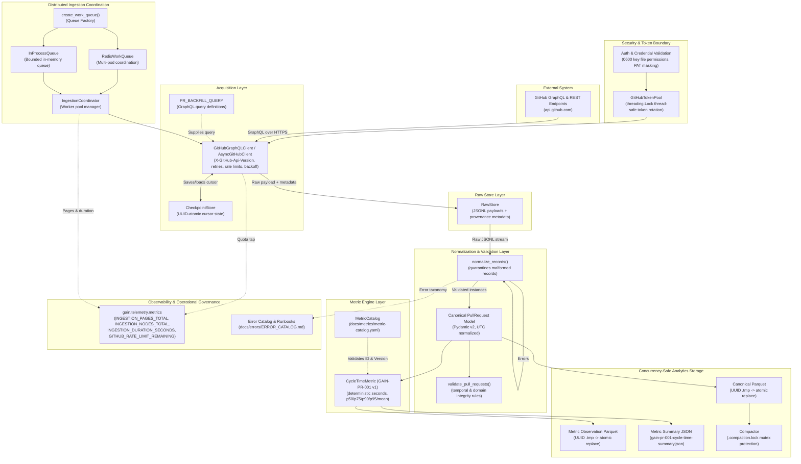

# GAIN Reference Architecture — Production Vertical Slice 1

## 1. System Mission & Context

GAIN (GitHub AI Intelligence Network) extracts GitHub engineering flow activity and produces high-integrity, deterministic, versioned metrics for engineering leadership and developer productivity analysis at enterprise scale (40,000+ repositories).

> [!NOTE]
> For the complete multi-tier enterprise architecture across all platform capabilities (telemetry adapters, canonical models, deterministic metrics, MCP server, autonomous agent, and interactive diagram), see [`docs/OVERALL_ARCHITECTURE.md`](OVERALL_ARCHITECTURE.md) and [`docs/architecture/gain_overall_architecture.html`](architecture/gain_overall_architecture.html).

This document defines the **production vertical slice** of the GAIN system, hardened for enterprise concurrency, security, and observability:
```
GitHub GraphQL / REST APIs
      │
      ▼
 Acquisition Layer (resilient client, auth, thread-safe token pool, pagination, rate limits, retries)
      │
      ▼
 Distributed Work Coordination (WorkQueue protocol, RedisWorkQueue / InProcessQueue, bounded workers)
      │
      ▼
 Raw API Capture (lossless JSONL with provenance metadata)
      │
      ▼
 Validation & Schema Normalization (Pydantic model, UTC enforcement, error quarantine)
      │
      ▼
 Canonical PullRequest Entity (transport-independent domain representation)
      │
      ▼
 Deterministic Metric Engine (pure Python, versioned catalog, zero LLM dependencies)
      │
      ▼
 Concurrency-Safe Storage Layer (atomic UUID writes, .compaction.lock mutex, Parquet datasets)
      │
      ▼
 Automated Tests & Runtime Telemetry (Prometheus metrics, Error Catalog, 308 tests, strict mypy)
```

---

## 2. Core Architectural Principles & Required Constraints

1. **GitHub Remains the Source of Truth**  
   All metrics derive strictly from observable GitHub engineering artifacts. The system stores unaltered raw payloads, ensuring that downstream metric calculations, re-aggregations, or revisions never alter or misrepresent upstream ground truth.

2. **Lossless Raw Capture with Provenance & Replayability**  
   Every payload fetched from GitHub is persisted verbatim in JSONL format prior to any domain normalization. Each raw node is encapsulated alongside immutable provenance metadata:
   - Ingestion Run ID (`ingestion_run_id`)
   - Repository Identification (`repository_id`, `repository_name_with_owner`)
   - Traversal Coordinates (`page_number`, `cursor`)
   - Ingestion Timestamp in UTC (`collected_at`)  
   Replay runs (`gain.storage.replay.replay_run`) allow reprocessing, testing new metric algorithms, and auditing without generating external API calls to GitHub.

3. **Transport-Independent Canonical Domain Model**  
   The domain model (`gain.model.pr.PullRequest`) is strictly decoupled from GitHub GraphQL transport topologies (connections, edges, cursors, GraphQL wrappers). The canonical model validates constraints (e.g. valid lifecycle states, positive file/line counts, timezone normalization) independently of the transport protocol.

4. **Deterministic, Zero-LLM Metric Engine**  
   Cycle time (`GAIN-PR-001`) is computed through pure, deterministic mathematical operations:
   $$\text{CycleTime} = \text{merged\_at} - \text{created\_at}$$
   The metric engine is explicitly versioned against the machine-readable Metric Catalog (`docs/metrics/metric-catalog.yaml`). **No LLM reasoning, heuristic guessing, or probabilistic inference is permitted in metric calculation.**

5. **Explicit Handling of Malformed or Incomplete Data**  
   Incomplete, malformed, or corrupt source records are quarantined and captured as structured errors with exact record indices and error descriptions. Normalization fails safely without crashing entire ingestion runs or corrupting aggregate metrics.

6. **Concurrency Safety & Storage Atomicity**  
   All storage writes (canonical Parquet datasets, cycle-time observations, monthly stats, and checkpoints) execute via unique UUID temporary files followed by atomic POSIX rename operations (`replace()`). Dataset compaction utilizes an exclusive file lock (`.compaction.lock`) to eliminate write races during multi-worker execution.

7. **Zero-Trust Security & PII Privacy**  
   PII de-identification utilizes an ephemeral 256-bit cryptographic salt (`secrets.token_bytes(32)`) in non-production, while strictly validating entropy (`>=16 chars`) in production environments. GitHub App private keys require strict POSIX permissions (`0600`). Personal Access Tokens are masked as `pat-***` and scrubbed from structured logs via regex redactors.

8. **Negative Scope for Slice 1 vs. Enterprise Extension Packages**  
   The core vertical slice (Slice 1: Ingestion -> Raw JSONL -> Canonical Parquet -> Deterministic Cycle Time) strictly excludes non-deterministic heuristics and probabilistic models. To support Fortune 100 enterprise environments without contaminating the zero-LLM core, additional capabilities are decoupled into layered enterprise subsystems:
   - **Core Ingestion & Analytics Engine** (`gain.sync`, `gain.storage`, `gain.metrics`, `gain.services`, `gain.ingestion`): Pure Python deterministic computations, zero LLM, strictly verified.
   - **Enterprise Protocol & Investigation Extensions** (`gain.mcp`, `gain.agent`, `gain.adapters`, `gain.requirements`): Optional enterprise integrations (Model Context Protocol server, investigative orchestration, Jira/Linear adapters) operating strictly downstream of canonical storage with isolated lifecycles.

---

## 3. Component Architecture & Boundaries



### 3.1 GitHub Client & Token Pool Specifications
- **API Version Tracking**: Explicitly sends `X-GitHub-Api-Version: 2022-11-28`.
- **Pagination**: Traverses cursor-based connections (`after: $cursor`) ordered by `CREATED_AT DESC`, terminating gracefully when crossing the configured date boundary (`since`).
- **Resilience & Backoff**: Exponential backoff with jitter ceiling (`base_backoff_seconds`, `retry_max_backoff_seconds`), handling HTTP 403, 429, 5xx, and network timeouts. Respects `retry-after` and `x-ratelimit-reset` headers.
- **Thread-Safe Token Rotation**: `GitHubTokenPool` synchronizes token acquisition, rate limit updates, and pool health across concurrent workers using `threading.Lock`.
- **Live Rate-Limit Instrumentation**: The client updates `GITHUB_RATE_LIMIT_REMAINING` gauge from incoming `x-ratelimit-remaining` response headers.

### 3.2 Canonical PullRequest Entity
`PullRequest` is an immutable, validated domain entity (`pydantic.BaseModel`):
- `github_node_id: str`
- `number: int` (greater than 0)
- `repository_name_with_owner: str`
- `repository_id: str`
- `author_login: str | None`
- `author_type: str | None`
- `created_at: datetime` (UTC)
- `closed_at: datetime | None` (UTC)
- `merged_at: datetime | None` (UTC)
- `state: str` (`OPEN`, `CLOSED`, `MERGED`)
- `is_draft: bool`
- `additions: int | None`
- `deletions: int | None`
- `changed_files: int | None`
- `review_decision: str | None`
- `collected_at: datetime` (UTC)
- `ingestion_run_id: str`

### 3.3 Metric Specification: GAIN-PR-001
- **Catalog ID**: `GAIN-PR-001`
- **Version**: `1`
- **Name**: `pr_cycle_time`
- **Formula**: `merged_at - created_at`
- **Unit**: Seconds (duration)
- **Null Policy**: Exclude unmerged PRs (`merged_at is None`) from cycle-time calculations.
- **Aggregations**: Count, p50, p75, p90, p95, arithmetic mean.
- **Analytical Guardrail**: Cycle time represents observable elapsed lifecycle time from PR creation to merge. It must not be characterized as individual coding time or developer effort.

### 3.4 Concurrency-Safe Storage & Compaction
- **Atomic Writes**: `write_canonical()`, `write_cycle_time_observations()`, and `write_monthly_stats()` prevent partial writes by streaming output to a unique UUID temporary file before invoking an atomic POSIX replace.
- **Compaction Lock Protection**: The dataset compactor (`gain.storage.compaction.Compactor`) protects partition compaction with an exclusive `.compaction.lock` file, preventing concurrent write races across worker pods.
- **Checkpoint Atomicity**: Checkpoints write through UUID temporary files before atomic replacement to prevent corrupted cursor states on process termination.

### 3.5 Runtime Telemetry & Operational Governance
- **Prometheus Metrics Registry**: Embedded metrics singleton (`gain.telemetry.metrics.REGISTRY`) exposes counters, gauges, and histograms across ingestion volume, latency, API quotas, and MCP requests.
- **Error Taxonomy**: Structured operational runbooks in [`docs/errors/ERROR_CATALOG.md`](errors/ERROR_CATALOG.md) provide mitigation procedures, severity classifications, and alert rules.

---

## 4. Verification & Quality Standards

- **308 Automated Tests Passing**: Comprehensive unit, integration, property, failure-path, and contract tests (`pytest -v`).
- **100% Strict Type Safety**: Full strict type annotations validated with zero errors across 193 source files (`mypy src tests --strict`).
- **Clean Linting**: Zero ruff warnings or formatting violations across the entire codebase (`ruff check src tests` and `ruff format --check src tests`).
- **Offline Replayability**: Complete pipeline reproducible from raw JSONL payloads without external network access.
