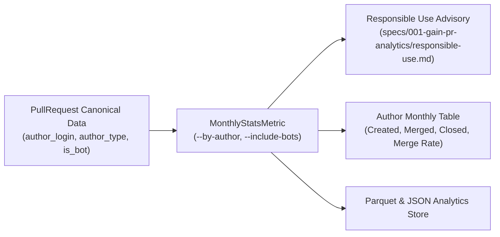

# GAIN — Author Metadata & Monthly Activity Walkthrough

## Overview

We updated GAIN to support **author-level monthly PR activity aggregation** while establishing strict **Responsible Use & Governance Guardrails** consistent with the GAIN project constitution.



---

## 1. Author Metadata Architecture

Author identity is already fully captured and preserved across the pipeline without requiring schema changes:
- **GraphQL API Query**: Selects `author { __typename, login }`.
- **Domain Model**: [`PullRequest`](file:///Users/mp/Downloads/GAIN-Production-Codebase-v0.1.0/src/gain/model/pr.py) stores `author_login`, `author_type`, and property `is_bot`.
- **Field Catalog**: Documented in [`docs/github-api/api-field-catalog.yaml`](file:///Users/mp/Downloads/GAIN-Production-Codebase-v0.1.0/docs/github-api/api-field-catalog.yaml) with `pii: yes-indirect`.
- **Canonical Parquet**: Persisted on every record in `data/canonical/pull_requests__<run_id>.parquet`.

---

## 2. Responsible Use & Analytical Guardrails

> [!CAUTION]
> **Why PR Counts Cannot Measure Individual Developer Productivity**:
> Per [`specs/001-gain-pr-analytics/responsible-use.md`](file:///Users/mp/Downloads/GAIN-Production-Codebase-v0.1.0/specs/001-gain-pr-analytics/responsible-use.md) and [`spec.md`](file:///Users/mp/Downloads/GAIN-Production-Codebase-v0.1.0/specs/001-gain-pr-analytics/spec.md#3-non-goals), **individual developer productivity scoring and employee ranking by PR volume are strictly prohibited uses** of GAIN:
> 
> 1. **Batch Size vs. Productivity (Goodhart's Law)**: PR count reflects transaction size and batching habits, not engineering output or business value. Measuring productivity by PR volume incentivizes developers to split trivial changes into multiple micro-PRs while avoiding complex refactors.
> 2. **Essential Invisible Work**: PR authoring ignores crucial engineering contributions: code reviews, incident response, architecture planning, pairing, mentoring, and technical design.
> 3. **Governance Mandate**: Author-level views are opt-in (`--by-author`) and must always display the **GAIN Responsible Use Advisory**.

---

## 3. Implementation Details

### Metric Engine (`src/gain/metrics/monthly_stats.py`)
- `MonthlyPRStats`: Added `author: str | None` and `author_type: str | None`.
- `MonthlyStatsMetric.calculate`:
  - Added `by_author: bool = False`
  - Added `include_bots: bool = True` (allows filtering out bots like `dependabot[bot]`)
  - Continuous chronological monthly timeline with zero-filling.
- `MonthlyStatsMetric.format_table`:
  - Renders `Author` column and automatically prepends the `[GAIN RESPONSIBLE USE ADVISORY]` banner.

### CLI Command (`src/gain/cli.py`)
```bash
# Author-level breakdown for trailing 3 months, excluding bots:
.venv/bin/python -m gain.cli monthly-stats \
  --canonical-path data/canonical/pull_requests__demo-run-001.parquet \
  --by-author \
  --no-include-bots \
  --months 3
```

---

## 4. Verification & Output

### Terminal Output (`--by-author --no-include-bots --months 3`)

```text
================================================================================
[GAIN RESPONSIBLE USE ADVISORY]
PR counts reflect workflow inventory, transaction frequency, and batching style.
They MUST NOT be used to measure individual developer productivity, effort, or
competence, nor for employee evaluation or ranking.
(Reference: specs/001-gain-pr-analytics/responsible-use.md)
================================================================================

Author           | Month   | Created |  Merged |  Closed | Unmerged | Merge Rate
-----------------+---------+---------+---------+---------+----------+-----------
alice            | 2026-06 |       0 |       0 |       0 |        0 |        N/A
alice            | 2026-07 |       1 |       1 |       1 |        0 |     100.0%
alice            | 2026-08 |       2 |       2 |       2 |        0 |     100.0%
bob              | 2026-06 |       0 |       0 |       0 |        0 |        N/A
bob              | 2026-07 |       0 |       0 |       0 |        0 |        N/A
bob              | 2026-08 |       1 |       1 |       1 |        0 |     100.0%
carol            | 2026-06 |       1 |       1 |       1 |        0 |     100.0%
carol            | 2026-07 |       0 |       0 |       0 |        0 |        N/A
carol            | 2026-08 |       1 |       1 |       1 |        0 |     100.0%
dave             | 2026-06 |       0 |       0 |       0 |        0 |        N/A
dave             | 2026-07 |       1 |       1 |       1 |        0 |     100.0%
dave             | 2026-08 |       1 |       1 |       1 |        0 |     100.0%
eve              | 2026-06 |       1 |       1 |       1 |        0 |     100.0%
eve              | 2026-07 |       0 |       0 |       0 |        0 |        N/A
eve              | 2026-08 |       1 |       0 |       1 |        1 |       0.0%
frank            | 2026-06 |       0 |       0 |       0 |        0 |        N/A
frank            | 2026-07 |       0 |       0 |       0 |        0 |        N/A
frank            | 2026-08 |       1 |       0 |       0 |        0 |        N/A
grace            | 2026-06 |       0 |       0 |       0 |        0 |        N/A
grace            | 2026-07 |       1 |       1 |       1 |        0 |     100.0%
grace            | 2026-08 |       2 |       2 |       2 |        0 |     100.0%
henry            | 2026-06 |       1 |       1 |       1 |        0 |     100.0%
henry            | 2026-07 |       0 |       0 |       0 |        0 |        N/A
henry            | 2026-08 |       2 |       1 |       1 |        0 |     100.0%
-----------------+---------+---------+---------+---------+----------+-----------
TOTAL            | All     |      17 |      14 |      15 |        1 |      93.3%
```

### Automated Tests (`pytest -v`)

```bash
$ .venv/bin/pytest -v
tests/test_github_client.py ..                                           [ 18%]
tests/test_metrics.py ..                                                 [ 36%]
tests/test_monthly_stats.py ......                                       [ 90%]
tests/test_schema.py .                                                   [100%]
============================== 11 passed in 0.27s ==============================
```
