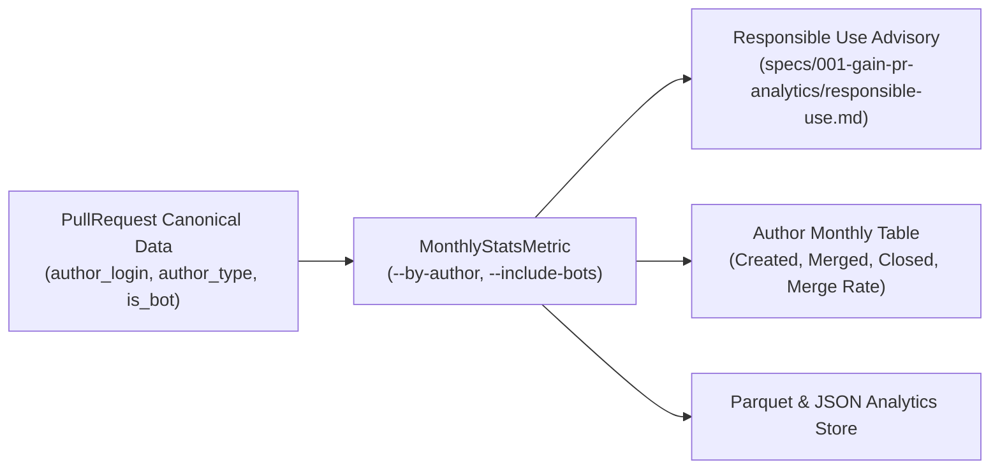

# GAIN — Author Metadata & Monthly Activity Walkthrough

## Overview

We updated GAIN to support **author-level monthly PR activity aggregation** while establishing strict **Responsible Use & Governance Guardrails** consistent with the GAIN project constitution.


```mermaid
flowchart LR
    A["PullRequest Canonical Data\n(author_login, author_type, is_bot)"] --> B["MonthlyStatsMetric\n(--by-author, --include-bots)"]
    B --> C["Responsible Use Advisory\n(specs/001-gain-pr-analytics/responsible-use.md)"]
    B --> D["Author Monthly Table\n(Created, Merged, Closed, Merge Rate)"]
    B --> E["Parquet & JSON Analytics Store"]
```

---

## 1. Author Metadata Architecture

Author identity is already fully captured and preserved across the pipeline without requiring schema changes:
- **GraphQL API Query**: Selects `author { __typename, login }`.
- **Domain Model**: [`PullRequest`](file:///Users/mp/Downloads/GAIN-Production-Codebase-v0.1.0/src/gain/model/pr.py) stores `author_login`, `author_type`, and property `is_bot`.
- **Field Catalog**: Documented in [`docs/github-api/api-field-catalog.yaml`](file:///Users/mp/Downloads/GAIN-Production-Codebase-v0.1.0/docs/github-api/api-field-catalog.yaml) with `pii: yes-indirect`.
- **Canonical Parquet**: Persisted on every record in `data/canonical/pull_requests__<run_id>.parquet`.

---

## 2. Responsible Use & Analytical Guardrails

> [!CAUTION]
> **Why PR Counts Cannot Measure Individual Developer Productivity**:
> Per [`specs/001-gain-pr-analytics/responsible-use.md`](file:///Users/mp/Downloads/GAIN-Production-Codebase-v0.1.0/specs/001-gain-pr-analytics/responsible-use.md) and [`spec.md`](file:///Users/mp/Downloads/GAIN-Production-Codebase-v0.1.0/specs/001-gain-pr-analytics/spec.md#3-non-goals), **individual developer productivity scoring and employee ranking by PR volume are strictly prohibited uses** of GAIN:
> 
> 1. **Batch Size vs. Productivity (Goodhart's Law)**: PR count reflects transaction size and batching habits, not engineering output or business value. Measuring productivity by PR volume incentivizes developers to split trivial changes into multiple micro-PRs while avoiding complex refactors.
> 2. **Essential Invisible Work**: PR authoring ignores crucial engineering contributions: code reviews, incident response, architecture planning, pairing, mentoring, and technical design.
> 3. **Governance Mandate**: Author-level views are opt-in (`--by-author`) and must always display the **GAIN Responsible Use Advisory**.

---

## 3. Implementation Details

### Metric Engine (`src/gain/metrics/monthly_stats.py`)
- `MonthlyPRStats`: Added `author: str | None` and `author_type: str | None`.
- `MonthlyStatsMetric.calculate`:
  - Added `by_author: bool = False`
  - Added `include_bots: bool = True` (allows filtering out bots like `dependabot[bot]`)
  - Continuous chronological monthly timeline with zero-filling.
- `MonthlyStatsMetric.format_table`:
  - Renders `Author` column and automatically prepends the `[GAIN RESPONSIBLE USE ADVISORY]` banner.

### CLI Command (`src/gain/cli.py`)
```bash
# Author-level breakdown for trailing 3 months, excluding bots:
.venv/bin/python -m gain.cli monthly-stats \
  --canonical-path data/canonical/pull_requests__demo-run-001.parquet \
  --by-author \
  --no-include-bots \
  --months 3
```

---

## 4. Verification & Output

### Terminal Output (`--by-author --no-include-bots --months 3`)

```text
================================================================================
[GAIN RESPONSIBLE USE ADVISORY]
PR counts reflect workflow inventory, transaction frequency, and batching style.
They MUST NOT be used to measure individual developer productivity, effort, or
competence, nor for employee evaluation or ranking.
(Reference: specs/001-gain-pr-analytics/responsible-use.md)
================================================================================

Author           | Month   | Created |  Merged |  Closed | Unmerged | Merge Rate
-----------------+---------+---------+---------+---------+----------+-----------
alice            | 2026-06 |       0 |       0 |       0 |        0 |        N/A
alice            | 2026-07 |       1 |       1 |       1 |        0 |     100.0%
alice            | 2026-08 |       2 |       2 |       2 |        0 |     100.0%
bob              | 2026-06 |       0 |       0 |       0 |        0 |        N/A
bob              | 2026-07 |       0 |       0 |       0 |        0 |        N/A
bob              | 2026-08 |       1 |       1 |       1 |        0 |     100.0%
carol            | 2026-06 |       1 |       1 |       1 |        0 |     100.0%
carol            | 2026-07 |       0 |       0 |       0 |        0 |        N/A
carol            | 2026-08 |       1 |       1 |       1 |        0 |     100.0%
dave             | 2026-06 |       0 |       0 |       0 |        0 |        N/A
dave             | 2026-07 |       1 |       1 |       1 |        0 |     100.0%
dave             | 2026-08 |       1 |       1 |       1 |        0 |     100.0%
eve              | 2026-06 |       1 |       1 |       1 |        0 |     100.0%
eve              | 2026-07 |       0 |       0 |       0 |        0 |        N/A
eve              | 2026-08 |       1 |       0 |       1 |        1 |       0.0%
frank            | 2026-06 |       0 |       0 |       0 |        0 |        N/A
frank            | 2026-07 |       0 |       0 |       0 |        0 |        N/A
frank            | 2026-08 |       1 |       0 |       0 |        0 |        N/A
grace            | 2026-06 |       0 |       0 |       0 |        0 |        N/A
grace            | 2026-07 |       1 |       1 |       1 |        0 |     100.0%
grace            | 2026-08 |       2 |       2 |       2 |        0 |     100.0%
henry            | 2026-06 |       1 |       1 |       1 |        0 |     100.0%
henry            | 2026-07 |       0 |       0 |       0 |        0 |        N/A
henry            | 2026-08 |       2 |       1 |       1 |        0 |     100.0%
-----------------+---------+---------+---------+---------+----------+-----------
TOTAL            | All     |      17 |      14 |      15 |        1 |      93.3%
```

### Automated Tests (`pytest -v`)

```bash
$ .venv/bin/pytest -v
tests/test_github_client.py ..                                           [ 18%]
tests/test_metrics.py ..                                                 [ 36%]
tests/test_monthly_stats.py ......                                       [ 90%]
tests/test_schema.py .                                                   [100%]
============================== 11 passed in 0.27s ==============================
```

---

## 5. Universal AI-Native SE 3.0 Scorecard Scanner Walkthrough

GAIN provides a zero-token, single-command scanner (`gain scan`) to evaluate any local or remote repository:

```bash
# Scan local repository with terminal scorecard
gain scan .

# Scan remote repository with markdown export
gain scan firmsoil/gain --days 90 --format markdown --out se3_scorecard.md

# Scan with JSON output for pipeline automation
gain scan firmsoil/gain --format json
```

### Sample Executive Output (`gain scan .`)

```text
=== GAIN AI-NATIVE SOFTWARE ENGINEERING (SE 3.0) SCORECARD ===
Repository:               firmsoil/gain
Evaluation Window:        90 days (Run ID: 6d6c6aef)
----------------------------------------------------------------------
1. AI ADOPTION & ATTRIBUTION TELEMETRY:
   - Evaluated PRs:       22 (AI-Assisted: 4)
   - AI Penetration Rate: 18.2%
   - Detected Tools:      Copilot, Cursor Composer

2. SE 2.0 BLOAT & CODE HEALTH (Hassan et al. 2026):
   - Refactoring Ratio:   38.4% (Pure Adds: 12.5%)
   - Code Bloat Index:    14.2 lines/file (4.5% flagged)

3. FLOW & VERIFICATION TAX (DORA 2026):
   - PR Cycle Time (p50): 18400.0s
   - Review Latency Mean: 12.4 hrs (8.3% >48h)
   - Hotfix / Defect Rate:4.2% of merged PRs

4. ECONOMIC VALUE LEDGER (Two-Ledger Model):
   - Net Economic Value:  $573,350.00
   - Reclaimed Capacity:  $110,000.00
----------------------------------------------------------------------
```

---

## 6. Deterministic CI/CD Quality Gate Walkthrough

GAIN integrates directly into GitHub Actions as an automated gate that inspects code health on incoming pull requests and breaks the build if bloat, additive churn, or review friction exceed mathematical limits:

```bash
# 1. Run local scan to emit machine-readable telemetry
gain scan . --format json > reports/gain_scorecard.json

# 2. Evaluate deterministic quality gate (returns exit code 1 if violated)
python scripts/evaluate_quality_gate.py --input reports/gain_scorecard.json
```

### Live PR Comment Generated by CI
On every pull request, the CI job automatically posts an executive scorecard comment:

```markdown
### 🛡️ GAIN AI-Native SE 3.0 Deterministic Quality Gate

# GAIN AI-Native Software Engineering (SE 3.0) Scorecard

**Target Repository:** `firmsoil/gain`  
**Evaluation Window:** 90 Days | **Run ID:** `d32abd78-bd8a-41c3-a4e3-790d799beeb1`  
**Theoretical Foundation:** Hassan et al. (ACM TOSEM 2026) & Google Cloud DORA 2026  

---

## 1. AI Presence & Attribution Telemetry
| Metric | Value | Interpretation |
| :--- | :--- | :--- |
| **Total PRs Evaluated** | `27` | Total pull requests evaluated in window |
| **AI-Assisted PRs** | `0` | PRs with verified in-tree AI evidence |
| **AI Penetration Rate** | `0.0%` | Proportion of flow with observed AI |
| **Detected Tools** | `None` | Tooling signatures detected in git |

---

## 2. SE 2.0 Additive Churn & Code Bloat Diagnostics
| Metric | Formula / Catalog ID | Value | Status |
| :--- | :--- | :--- | :--- |
| **Refactoring Ratio** | `GAIN-QUAL-003` | `0.0%` | Pure adds: `0.0%` |
| **Code Bloat Index** | `GAIN-QUAL-004` | `0.0 lines/f` | Bloat (>100): `0.0%` |

---

## 3. Flow Velocity & Verification Tax
| Metric | Catalog ID | Value | Notes |
| :--- | :--- | :--- | :--- |
| **Median Cycle Time (p50)** | `GAIN-PR-001` | `3600.0s` | PR duration (created to merged) |
| **Review Queue Latency** | `GAIN-QUAL-005` | `1.0h` | Friction (>48h): `0.0%` |
| **Defect Rework Rate** | `GAIN-QUAL-006` | `0.0%` | Hotfix / rollback frequency |

---

## 4. Google Cloud DORA 2026 Two-Ledger Economics
- **Estimated Net Benefit:** `$573,350.00`
- **Reclaimed Headcount Capacity:** `$110,000.00`
- **Estimated Tool Investment:** `$182,650.00`
- **Payback Period:** `0.24 years`
```

For complete integration instructions across any external repository, see [`docs/CI_CD_QUALITY_GATE.md`](CI_CD_QUALITY_GATE.md).


