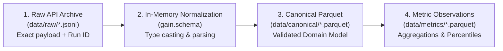

## Executive Overview: The Paradigm Shift

### Moving from "Vibe Coding" to Spec-Driven Engineering

:::: {.columns}

::: {.column width="50%"}
#### ⚠️ Ad-Hoc AI Coding ("Vibe Coding")
- **Prompt & Hope**: Jumping straight to code generation from unconstrained conversational prompts.
- **Architectural Drift**: Invariants, domain models, and schemas mutate across AI interactions.
- **Hallucinated Invariants**: Assumptions are silently invented by LLMs without validation.
- **Fragile Tech Debt**: Code velocity accelerates, but system predictability and defensibility collapse.
:::

::: {.column width="50%"}
#### 🛡️ Spec-Driven Development (SDD)
- **Spec is the Codebase**: The formal specification is the canonical, versioned source of truth.
- **Code as Disposable Artifact**: Code is merely a downstream byproduct synthesized to satisfy contracts.
- **Deterministic Guardrails**: Machine-verifiable schemas, quality rules, and metric definitions.
- **Human Authority**: Strict sign-off gates before code generation or issue promotion.
:::

::::

::: {.callout-note}
### Core Principle (Microsoft Developer Blog Reference)
*"As AI coding agents commoditize raw syntax generation, the primary architectural bottleneck shifts from writing code to defining explicit, verifiable specifications that govern behavior."*
:::

---

## The Core Invariant: The Inverted Lifecycle

### Intent Precedes Implementation

```{mermaid}
flowchart LR
    A["1. Constitution<br/>(Foundational Principles)"] --> B["2. Specification<br/>(spec.md: What & Why)"]
    B --> C["3. Clarification<br/>(clarifications.md: Policy Defaults)"]
    C --> D["4. Technical Plan<br/>(plan.md: Architecture & Storage)"]
    D --> E["5. Quality Checklist<br/>(requirements.md: Pre-Code Gate)"]
    E --> F["6. Tasks Breakdown<br/>(tasks.md: Atomic Phases)"]
    F --> G["7. Implementation<br/>(src/gain/: Code & Tests)"]
```

:::: {.columns}
::: {.column width="33%"}
::: {.callout-tip}
#### 1. Zero Implementation Leakage
Functional requirements define observable behaviors and personas—never implementation tech stacks.
:::
:::
::: {.column width="33%"}
::: {.callout-note}
#### 2. Explicit Ambiguity Resolution
Uncertain policies (e.g. bot exclusion, backfill windows) are resolved in `clarifications.md` before coding.
:::
:::
::: {.column width="33%"}
::: {.callout-important}
#### 3. Verification Precedes Expansion
Every stage must pass automated consistency gates (`/speckit.analyze`) before implementation proceeds.
:::
:::
::::

---

## The 9-Stage Spec Kit Lifecycle in GAIN

### Engineering Governance via Versioned Markdown Artifacts

| Stage | Spec Kit Command | Primary Artifact | GAIN Operational Implementation |
|---|---|---|---|
| **1. Constitution** | `/speckit.constitution` | Charter Principles | Defines analytical integrity, responsible use, secret masking, least privilege. |
| **2. Specify** | `/speckit.specify` | `specs/001/spec.md` | Captures 10 Functional Requirements (`FR-001`–`FR-010`), personas, and non-goals. |
| **3. Clarify** | `/speckit.clarify` | `clarifications.md` | Resolves bot filtering, 365d backfill, 30d lookback, cohort boundaries. |
| **4. Plan** | `/speckit.plan` | `specs/001/plan.md` | GraphQL-first client, DuckDB/Parquet storage, exponential backoff retries. |
| **5. Checklist** | `/speckit.checklist` | `checklists/requirements.md` | 12-point quality gate verifying testability, pagination, and data invariants. |
| **6. Tasks** | `/speckit.tasks` | `specs/001/tasks.md` | Decomposes roadmap into sequenced tasks across Phases 0 through 6. |
| **7. Analyze** | `/speckit.analyze` | Consistency Gate | Read-only check verifying cross-artifact integrity before code execution. |
| **8. Implement** | `/speckit.implement` | `src/gain/` | Implementation strictly driven by task acceptance criteria and unit tests. |
| **9. Converge** | `/speckit.converge` | Convergence Loop | Validates output data against Metric Catalog, appending remediation tasks if needed. |

---

## Thin Vertical Slice Strategy

### De-risking Delivery by Proving the Critical Path First

:::: {.columns}

::: {.column width="45%"}
#### The Anti-Pattern: Horizontal Sprawl
- Building extensive data models without ingestion.
- Writing complex UI or reports before validating pipelines.
- Accumulating unverified assumptions across multiple subsystems simultaneously.
:::

::: {.column width="55%"}
#### GAIN's Thin Vertical Slice (Phase 1)
```text
GitHub GraphQL API
      ↓ (Cursor-based pagination, max 100)
gain.github.client (Transport & rate limits)
      ↓ (Raw JSONL persistence + provenance)
data/raw/ (Immutable audit archive)
      ↓ (gain.schema canonical normalization)
gain.model.pr.PullRequest (Pydantic validation)
      ↓ (gain.metrics.cycle_time calculation)
GAIN-PR-001 Cycle Time (Percentile distributions)
      ↓ (gain.storage.analytics Parquet export)
Verified Outputs & Offline Demo
```
:::

::::

::: {.callout-tip}
### Core Benefit
Phase 1 validated end-to-end telemetry flow, storage, and mathematics **before** undertaking Phase 2 (resilience) or Phase 3 (advanced metrics).
:::

---

## Human Authority & AI Governance

### Package `002-requirements-jira-sdd`: Demoting AI to Non-Authoritative Drafts

```{mermaid}
flowchart LR
    BC["Business Context<br/>(Human Input)"] --> LLM["AI Story Generator<br/>(Schema Constrained)"]
    LLM --> Draft["Generated Draft<br/>(Non-Authoritative)"]
    Draft --> Gate{"Human Review<br/>& Approval Gate"}
    Gate -- Rejected --> Revision["Human Revision<br/>& Re-Prompting"]
    Revision --> Draft
    Gate -- Approved --> Approved["Canonical Requirement<br/>(Status: APPROVED)"]
    Approved --> SDD["SDD Spec Promotion<br/>(Specification Seed)"]
    Approved --> Jira["External Projection<br/>(Jira Issue via Adapter)"]
```

:::: {.columns}

::: {.column width="50%"}
#### Governance Invariants
- AI output is **strictly non-authoritative**.
- Promotion to specification seed **requires explicit named human approval**:
  `approved_by`, `approved_at`, `reviewed_by`.
:::

::: {.column width="50%"}
```python
# Programmatic Invariant in src/gain/requirements/sdd.py
def build_specification_seed(story: CanonicalStory) -> SDDSpecificationSeed:
    if story.lifecycle_status != StoryLifecycleStatus.APPROVED:
        raise RequirementValidationError(
            "Only an approved story can be promoted to an SDD spec seed"
        )
    return SDDSpecificationSeed(...)
```
:::

::::

---

## Decoupling External Trackers: Jira as an Adapter

### The Trap: Letting Issue Trackers Dictate Architecture

:::: {.columns}

::: {.column width="50%"}
#### ❌ The Jira-Centric Pitfall
- Domain models leak Jira schema (`jira_issue_key`, `customfield_10014`, ADF nodes).
- Development workflows halt when Jira API is offline or unauthenticated.
- Pure Git/SDD engineering teams are locked into external enterprise software.
:::

::: {.column width="50%"}
#### ✅ GAIN's Hexagonal Architecture
- **Internal Domain Entity**: `CanonicalRequirement` is the authoritative internal domain model.
- **Decoupled Reference**: External systems mapped via `ExternalReference`:
  ```python
  class ExternalReference(BaseModel):
      external_system: str      # "jira", "github", "azure"
      external_key: str | None  # "PROJ-101"
      external_url: str | None
      metadata: dict[str, Any]
  ```
- **Jira is Purely an Adapter**: `gain.requirements.jira` isolates ADF formatting, HTTP transport, and error containment.
:::

::::

::: {.callout-tip}
### Strategic Outcome
GAIN operates with **zero Jira dependency** in pure Git/SDD mode, while supporting deterministic bidirectional Jira synchronization when desired.
:::

---

## Executable Contracts & Data Quality Engine

### Machine-Verifiable Semantic Guardrails

:::: {.columns}

::: {.column width="50%"}
#### 1. Input & Metric Authority
- **Input API Contract** (`input-api-contract.md`): Defines GraphQL query shape, pagination cursors, and rate-limit points.
- **Metric Catalog Authority** (`metric-catalog.yaml`): Every calculation must match a versioned, authorized formula:
  ```python
  catalog = MetricCatalog("docs/metrics/metric-catalog.yaml")
  definition = catalog.get("GAIN-PR-001")
  if definition["metric_version"] != CycleTimeMetric.metric_version:
      raise BadParameter("Code and Metric Catalog versions mismatch")
  ```
:::

::: {.column width="50%"}
#### 2. Programmatic Quality Engine (`gain.quality`)
- **Semantic Invariants**:
  - `merged_at < created_at`: ❌ Strictly invalid (negative duration).
  - `closed_at < created_at`: ❌ Strictly invalid.
  - Duplicate Node IDs: ❌ Detected and flagged.
  - Merged without `closed_at`: ⚠️ Warning flag.
- **Zero Silent Dropping**: Invalid records surfaced in structured `normalization_report.json`.
:::

::::

---

## 4-Tier Pipeline & Deterministic Replayability

### Audit Provenance & Offline Verifiability



:::: {.columns}

::: {.column width="50%"}
#### Cryptographic Provenance
- Ingestion audit stamps on every raw and canonical record: `ingestion_run_id`, `source_collected_at`.
- Requirements track SHA-256 `input_hash` and `output_hash` across all AI revisions.
:::

::: {.column width="50%"}
#### Replayability Guarantee
- If a metric formula or business definition changes:
  - **No need to re-query the GitHub API.**
  - Re-run canonical transformations directly from archived raw JSONL using `gain.storage.replay`.
:::

::::

---

## Live Case Study: Validation on Spinnaker Telemetry

### Testing Real-World Telemetry: `firmsoil/spinnaker` & `spinnaker/spinnaker`

:::: {.columns}

::: {.column width="50%"}
#### Real Bugs Caught by Live Execution
1. **GraphQL Query Signature**: GitHub schema rejects queries declaring unused variables (`$since`, `$until`). Fixed in `gain.github.queries`.
2. **PR Lifecycle Enum**: GitHub GraphQL returns state `MERGED`, which was previously rejected by a strict `OPEN/CLOSED` validator. Fixed in `gain.model.pr`.
3. **Configuration Ergonomics**: Added `AliasChoices` for seamless `GITHUB_TOKEN` resolution.
:::

::: {.column width="50%"}
#### Live Analytics Yield (`GAIN-PR-001` & `010`)
- **67 PRs Ingested** across 14 GraphQL pages.
- **60 Merged PRs Analyzed**:
  - **p50 (Median Cycle Time)**: 19.4 hours
  - **Mean Cycle Time**: 2.5 days
  - **p90 Cycle Time**: 6.3 days
- **Monthly PR Flow Balance Sheet**:
  - Aug 2026: 67 Created, 55 Merged, 59 Closed (93.2% Merge Rate)
  - Sep 2026: 5 Merged, 5 Closed (100% Merge Rate)
  - **Total Merge Rate: 93.8%**
:::

::::

---

## Strategic ROI & Enterprise Architecture Impact

### Why Spec-Driven Development is Essential for AI-Native Organizations

:::: {.columns}

::: {.column width="33%"}
#### 🎯 Predictable Delivery
- Guaranteed alignment between PM intent, architectural specs, and AI code generation.
- Zero "prompt drift" or architectural corruption across developer iterations.
:::

::: {.column width="33%"}
#### ⚖️ Defensible Analytics
- Engineering leaders make high-stakes resource decisions based on GAIN.
- Every number traces back to a versioned mathematical formula in `metric-catalog.yaml`.
:::

::: {.column width="33%"}
#### 🔄 Code Reusability & Agility
- Because code is treated as downstream byproduct, entire subsystems can be safely refactored or regenerated by AI agents against invariant specs.
:::

::::

::: {.callout-note}
### Responsible Use Invariant (`responsible-use.md`)
*GAIN measures **system flow latency and batching efficiency**—never developer coding time or individual performance. Ethical boundaries are codified as architectural invariants.*
:::

---

## Conclusion & Repository Architecture Map

### The Specification Portfolio as Single Source of Truth

```text
specs/
├── README.md                          # Master Product & Developer Onboarding Guide
├── 001-gain-pr-analytics/             # Core Telemetry Pipeline & Metrics Package
│   ├── spec.md                        # Functional requirements, personas & non-goals
│   ├── plan.md                        # Technical architecture & storage strategy
│   ├── tasks.md                       # Phased atomic task sequencing (Phases 0–6)
│   ├── data-model.md                  # Canonical entity definitions & invariants
│   ├── responsible-use.md             # Ethical policies & interpretation guardrails
│   └── contracts/                     # Machine-readable input & output schemas
└── 002-requirements-jira-sdd/         # Requirements Engineering & Adapter Layer
    ├── spec.md                        # Governed requirements lifecycle requirements
    ├── plan.md                        # Adapter isolation & dependency inversion
    └── data-model.md                  # CanonicalRequirement & ExternalReference models
```

::: {.callout-tip}
### Key Executive Takeaway
Spec-Driven Development gives engineering leaders the **velocity of AI generation** paired with the **control, predictability, and defensibility of formal systems engineering**.
:::
