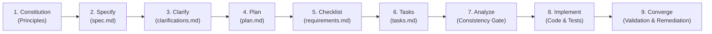
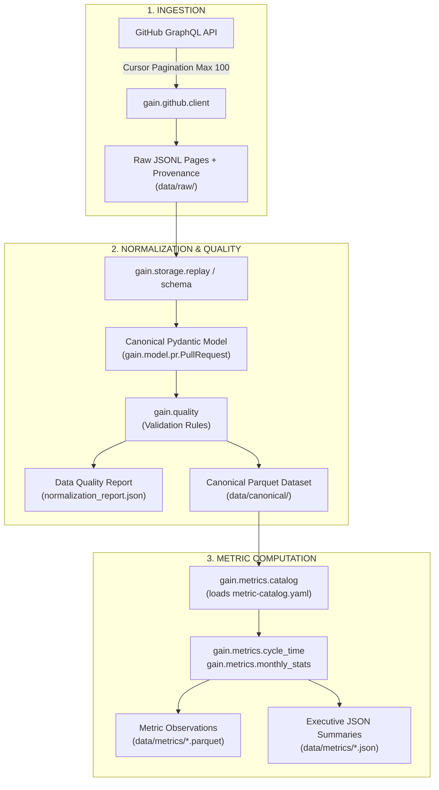

# GAIN Specifications (`specs/`) — Product & Developer Guide

Welcome to the **GAIN (GitHub AI Intelligence Network)** specifications repository. This directory houses the canonical Spec-Driven Development (SDD) artifacts that govern the design, analytical correctness, architectural contracts, and implementation roadmap of the GAIN data product.

This document serves as the operational handbook for **Product Managers (PMs)** and **Software / Data Engineers** collaborating on GAIN. It provides a comprehensive map of all specifications, explains how to navigate and maintain them, and details actionable workflows for extending the system.

The GitHub PR analytics package (`specs/001-gain-pr-analytics/`) provides the data pipeline and metrics SDD baseline. The upstream requirements engineering package ([`specs/002-requirements-jira-sdd/`](002-requirements-jira-sdd/README.md)) establishes the **GAIN Canonical Requirement** as the authoritative internal domain model independent of external issue trackers. Jira is modeled strictly as an external adapter and projection target, enabling pure Git/SDD workflows to operate with zero Jira dependency while supporting deterministic bidirectional Jira synchronization when desired.


---

## Table of Contents

1. [Quick Start: Role-Based Navigation](#1-quick-start-role-based-navigation)
   - [For Product Managers](#for-product-managers)
   - [For Developers & Engineers](#for-developers--engineers)
2. [Spec-Driven Development (SDD) & Spec Kit Workflow](#2-spec-driven-development-sdd--spec-kit-workflow)
   - [The 9-Stage Spec Kit Lifecycle](#the-9-stage-spec-kit-lifecycle)
   - [Why Spec-Driven Development Matters for GAIN](#why-spec-driven-development-matters-for-gain)
3. [Folder Structure & Complete Artifact Catalog](#3-folder-structure--complete-artifact-catalog)
   - [Inventory of `specs/001-gain-pr-analytics/`](#inventory-of-specs001-gain-pr-analytics)
   - [Deep-Dive into Key Specifications](#deep-dive-into-key-specifications)
4. [System Architecture & Data Flow](#4-system-architecture--data-flow)
   - [Data Pipeline Stages](#data-pipeline-stages)
   - [The Four Data Layers](#the-four-data-layers)
5. [Product Manager Playbook](#5-product-manager-playbook)
   - [Core Analytical Guardrails & Non-Goals](#core-analytical-guardrails--non-goals)
   - [How to Author a New Feature Specification](#how-to-author-a-new-feature-specification)
   - [Requirements Quality Gate Checklist](#requirements-quality-gate-checklist)
   - [Responsible Use Policy & Stakeholder Communication](#responsible-use-policy--stakeholder-communication)
6. [Developer Practical Handbook](#6-developer-practical-handbook)
   - [Local Development Setup](#local-development-setup)
   - [Codebase Mapping to Specifications](#codebase-mapping-to-specifications)
   - [How to Implement a Task from `tasks.md`](#how-to-implement-a-task-from-tasksmd)
   - [How to Execute the Requirements & SDD Lifecycle](#how-to-execute-the-requirements--sdd-lifecycle)
   - [How to Add a New Metric](#how-to-add-a-new-metric)
   - [How to Extend GitHub Ingestion & API Contracts](#how-to-extend-github-ingestion--api-contracts)
   - [Testing & Quality Verification](#testing--quality-verification)
7. [Implementation Roadmap & Tracking](#7-implementation-roadmap--tracking)
   - [GitHub PR Analytics Pipeline](#github-analytics-pipeline-phases-specs001-gain-pr-analytics)
   - [Requirements Engineering & Jira SDD](#requirements-engineering--jira-sdd-phases-specs002-requirements-jira-sdd)
8. [Glossary & Reference Links](#8-glossary--reference-links)

---

## 1. Quick Start: Role-Based Navigation

### For Product Managers

If you are a Product Manager joining the team or defining new capabilities:

```text
Step 1: Read [spec.md](file:///Users/mp/Downloads/GAIN-Production-Codebase-v0.1.0/specs/001-gain-pr-analytics/spec.md) to understand user personas, problem space, and boundaries.
Step 2: Read [responsible-use.md](file:///Users/mp/Downloads/GAIN-Production-Codebase-v0.1.0/specs/001-gain-pr-analytics/responsible-use.md) for non-negotiable ethical and analytical guardrails.
Step 3: Review [docs/metrics/metric-catalog.yaml](file:///Users/mp/Downloads/GAIN-Production-Codebase-v0.1.0/docs/metrics/metric-catalog.yaml) to see currently standardized metric definitions.
Step 4: Check [tasks.md](file:///Users/mp/Downloads/GAIN-Production-Codebase-v0.1.0/specs/001-gain-pr-analytics/tasks.md) for milestone progress (MVP vs Phase 2-6 roadmap).
Step 5: Use [checklists/requirements.md](file:///Users/mp/Downloads/GAIN-Production-Codebase-v0.1.0/specs/001-gain-pr-analytics/checklists/requirements.md) when drafting new requirements.
```

**Key PM Rule**: Never equate PR duration (`merged_at - created_at`) with developer "coding time" or individual productivity. GAIN measures **system flow latency**.

---

### For Developers & Engineers

If you are a Software or Data Engineer implementing features or fixing bugs:

```text
Step 1: Read [quickstart.md](file:///Users/mp/Downloads/GAIN-Production-Codebase-v0.1.0/specs/001-gain-pr-analytics/quickstart.md) to set up your environment with `uv` and run the offline demo.
Step 2: Read [plan.md](file:///Users/mp/Downloads/GAIN-Production-Codebase-v0.1.0/specs/001-gain-pr-analytics/plan.md) and [docs/architecture/vertical-slice.md](file:///Users/mp/Downloads/GAIN-Production-Codebase-v0.1.0/docs/architecture/vertical-slice.md) for system architecture.
Step 3: Read [data-model.md](file:///Users/mp/Downloads/GAIN-Production-Codebase-v0.1.0/specs/001-gain-pr-analytics/data-model.md) for canonical entities, natural keys, and validation invariants.
Step 4: Read [contracts/input-api-contract.md](file:///Users/mp/Downloads/GAIN-Production-Codebase-v0.1.0/specs/001-gain-pr-analytics/contracts/input-api-contract.md) and [contracts/outputs.md](file:///Users/mp/Downloads/GAIN-Production-Codebase-v0.1.0/specs/001-gain-pr-analytics/contracts/outputs.md) for API and storage boundaries.
Step 5: Pick your assigned task in [tasks.md](file:///Users/mp/Downloads/GAIN-Production-Codebase-v0.1.0/specs/001-gain-pr-analytics/tasks.md) and follow the task execution workflow.
```

**Key Developer Rule**: Analytics never query GitHub API responses directly. All transformations must process **canonical domain models** (`gain.model.pr.PullRequest`), preserving raw JSONL provenance for offline replayability.

---

## 2. Spec-Driven Development (SDD) & Spec Kit Workflow

GAIN is built strictly using **Spec-Driven Development (SDD)** via the Spec Kit methodology. Code is treated as the downstream byproduct of explicit, versioned, validated specifications.

### The 9-Stage Spec Kit Lifecycle



| Phase | Spec Kit Command | Primary Artifact | Purpose |
|---|---|---|---|
| **1. Constitution** | `/speckit.constitution` | Project Charter / Principles | Defines governing engineering principles: analytical integrity, least privilege, replayability. |
| **2. Specify** | `/speckit.specify` | [`spec.md`](file:///Users/mp/Downloads/GAIN-Production-Codebase-v0.1.0/specs/001-gain-pr-analytics/spec.md) | Captures user stories, functional requirements (FRs), non-functional requirements (NFRs), goals, and non-goals. |
| **3. Clarify** | `/speckit.clarify` | [`clarifications.md`](file:///Users/mp/Downloads/GAIN-Production-Codebase-v0.1.0/specs/001-gain-pr-analytics/clarifications.md) | Resolves technical and policy ambiguities (e.g., bot filtering, 365-day backfill, 30-day lookback). |
| **4. Plan** | `/speckit.plan` | [`plan.md`](file:///Users/mp/Downloads/GAIN-Production-Codebase-v0.1.0/specs/001-gain-pr-analytics/plan.md) | Architectural blueprint: package decomposition, storage engines, error & retry strategies. |
| **5. Checklist** | `/speckit.checklist` | [`checklists/requirements.md`](file:///Users/mp/Downloads/GAIN-Production-Codebase-v0.1.0/specs/001-gain-pr-analytics/checklists/requirements.md) | Quality gate verifying completeness, testability, and edge case coverage before task creation. |
| **6. Tasks** | `/speckit.tasks` | [`tasks.md`](file:///Users/mp/Downloads/GAIN-Production-Codebase-v0.1.0/specs/001-gain-pr-analytics/tasks.md) | Decomposes the plan into sequenced, atomic tasks grouped by implementation phase. |
| **7. Analyze** | `/speckit.analyze` | Consistency Report | Read-only verification that checks cross-artifact integrity (e.g. all metrics in `spec.md` have tasks in `tasks.md`). |
| **8. Implement** | `/speckit.implement` | `src/gain/`, `tests/` | Code implementation adhering strictly to tasks, verified by automated unit and integration tests. |
| **9. Converge** | `/speckit.converge` | Remediation Tasks / PR | Final gate comparing implementation against specs and metric catalogs; closes gaps before release. |

### Why Spec-Driven Development Matters for GAIN

1. **Defensibility**: Engineering leaders make high-stakes decisions based on GAIN metrics. Every calculation must trace back to an authorized definition in [`docs/metrics/metric-catalog.yaml`](file:///Users/mp/Downloads/GAIN-Production-Codebase-v0.1.0/docs/metrics/metric-catalog.yaml).
2. **Replayability**: If an analytical formula changes, raw GitHub telemetry is already archived in JSONL. GAIN can re-run canonical transformations without re-querying the GitHub API.
3. **No Unintentional Scope Creep**: Spec Kit forces cross-artifact validation before code is written, ensuring edge cases (such as draft PRs, unmerged PRs, bots, and rate limits) are handled uniformly.

---

## 3. Folder Structure & Complete Artifact Catalog

The `specs/` directory is organized by feature packages. The repository contains two integrated packages:
1. `specs/001-gain-pr-analytics/`: Core PR ingestion, canonical normalization, data quality engine, and flow metrics.
2. `specs/002-requirements-jira-sdd/`: Upstream human-governed requirements engineering, AI story drafting, Jira adapter integration, and SDD specification seed promotion.

```text
specs/
├── README.md                                  # You are here: Master specifications & onboarding guide
├── 001-gain-pr-analytics/                     # Core Feature Package: PR Ingestion, Normalization & Metrics
│   ├── README.md                              # Package-level overview & quick links
│   ├── spec.md                                # Product specification (goals, stories, FRs, NFRs)
│   ├── clarifications.md                      # Resolved edge cases & recommended architectural defaults
│   ├── plan.md                                # Technical implementation architecture & design
│   ├── tasks.md                               # Actionable task list organized by phases (T001 - T603)
│   ├── data-model.md                          # Canonical entity definitions, natural keys, and lineage
│   ├── quickstart.md                          # Developer quickstart and CLI execution commands
│   ├── research.md                            # Technology trade-offs (GraphQL vs REST, DORA, DuckDB)
│   ├── responsible-use.md                     # Ethical guardrails, prohibited uses & interpretation rules
│   ├── spec-kit-command-sequence.md           # Prescribed order of Spec Kit execution
│   ├── implementation-prompts.md              # Reusable agent prompts for each SDD lifecycle stage
│   ├── checklists/
│   │   └── requirements.md                    # 12-point specification completeness checklist
│   └── contracts/
│       ├── api-contracts.md                   # Field provenance & query versioning standards
│       ├── input-api-contract.md              # GitHub GraphQL query contract (MVP required vs optional fields)
│       └── outputs.md                         # Schemas for Parquet datasets, reports, and executive KPIs
└── 002-requirements-jira-sdd/                 # Requirements Engineering, Jira Adapter & SDD Integration
    ├── README.md                              # Package overview & mental model
    ├── spec.md                                # Functional requirements for governed requirements lifecycle
    ├── clarifications.md                      # Authority boundaries, Jira source of truth, conflict handling
    ├── plan.md                                # Architectural layers, dependency boundaries, storage design
    ├── data-model.md                          # Canonical requirement model, ExternalReference & Jira projection
    └── tasks.md                               # Implementation tasks (R001 - R012)
```

### Inventory of `specs/001-gain-pr-analytics/`

| Artifact | File Link | Owner | Key Questions Answered |
|---|---|---|---|
| **Product Spec** | [`spec.md`](file:///Users/mp/Downloads/GAIN-Production-Codebase-v0.1.0/specs/001-gain-pr-analytics/spec.md) | PM | What problem are we solving? Who are the personas? What are the functional requirements (FR-001 to FR-010)? |
| **Clarifications** | [`clarifications.md`](file:///Users/mp/Downloads/GAIN-Production-Codebase-v0.1.0/specs/001-gain-pr-analytics/clarifications.md) | PM & Lead Eng | How do we handle bots? What is the backfill window (365d)? What is the lookback window (30d)? |
| **Plan** | [`plan.md`](file:///Users/mp/Downloads/GAIN-Production-Codebase-v0.1.0/specs/001-gain-pr-analytics/plan.md) | Lead Eng | What are the Python modules? What storage engine do we use (Parquet/DuckDB)? How do we retry errors? |
| **Tasks** | [`tasks.md`](file:///Users/mp/Downloads/GAIN-Production-Codebase-v0.1.0/specs/001-gain-pr-analytics/tasks.md) | Eng Team | What are the concrete engineering tasks? What is done vs remaining in Phases 0–6? |
| **Data Model** | [`data-model.md`](file:///Users/mp/Downloads/GAIN-Production-Codebase-v0.1.0/specs/001-gain-pr-analytics/data-model.md) | Data Architect | What entities exist (`PullRequest`, `Actor`, `IngestionRun`)? What are the primary keys and invariants? |
| **Responsible Use** | [`responsible-use.md`](file:///Users/mp/Downloads/GAIN-Production-Codebase-v0.1.0/specs/001-gain-pr-analytics/responsible-use.md) | PM & Leadership | What uses are strictly forbidden? How do we prevent developer surveillance or gaming? |
| **Requirements Checklist** | [`checklists/requirements.md`](file:///Users/mp/Downloads/GAIN-Production-Codebase-v0.1.0/specs/001-gain-pr-analytics/checklists/requirements.md) | PM | Are requirements observable? Are metric formulas testable? Is API pagination accounted for? |
| **API Contract** | [`contracts/api-contracts.md`](file:///Users/mp/Downloads/GAIN-Production-Codebase-v0.1.0/specs/001-gain-pr-analytics/contracts/api-contracts.md) | Eng | Where is field-level provenance defined? (`api-field-catalog.yaml`). |
| **Input API Contract** | [`contracts/input-api-contract.md`](file:///Users/mp/Downloads/GAIN-Production-Codebase-v0.1.0/specs/001-gain-pr-analytics/contracts/input-api-contract.md) | Eng | What fields are queried in GraphQL? How are rate limits and errors handled? |
| **Output Contract** | [`contracts/outputs.md`](file:///Users/mp/Downloads/GAIN-Production-Codebase-v0.1.0/specs/001-gain-pr-analytics/contracts/outputs.md) | Eng | What tables are emitted (`canonical_pull_requests`, `metric_observations`, `reports`)? |
| **Research** | [`research.md`](file:///Users/mp/Downloads/GAIN-Production-Codebase-v0.1.0/specs/001-gain-pr-analytics/research.md) | Eng | Why GraphQL over REST? Why Polars/DuckDB over relational databases? Why is GAIN not DORA? |
| **Quickstart** | [`quickstart.md`](file:///Users/mp/Downloads/GAIN-Production-Codebase-v0.1.0/specs/001-gain-pr-analytics/quickstart.md) | Eng | How do I clone, install, backfill, compute, and test the project locally? |
| **Command Sequence** | [`spec-kit-command-sequence.md`](file:///Users/mp/Downloads/GAIN-Production-Codebase-v0.1.0/specs/001-gain-pr-analytics/spec-kit-command-sequence.md) | All | What is the exact sequence of Spec Kit slash commands to run? |
| **Prompts** | [`implementation-prompts.md`](file:///Users/mp/Downloads/GAIN-Production-Codebase-v0.1.0/specs/001-gain-pr-analytics/implementation-prompts.md) | All | What prompts are passed to LLM agents for each Spec Kit stage? |

### Inventory of `specs/002-requirements-jira-sdd/`

| Artifact | File Link | Owner | Key Questions Answered |
|---|---|---|---|
| **Requirements Spec** | [`002/spec.md`](file:///Users/mp/Downloads/GAIN-Production-Codebase-v0.1.0/specs/002-requirements-jira-sdd/spec.md) | PM & Lead Architect | How does human business context become an approved canonical requirement? What are the acceptance criteria for AI generation and Jira export? |
| **Clarifications** | [`002/clarifications.md`](file:///Users/mp/Downloads/GAIN-Production-Codebase-v0.1.0/specs/002-requirements-jira-sdd/clarifications.md) | Lead Architect | What is the source of truth between GAIN and Jira? How are conflicts and non-authoritative Jira imports handled? |
| **Architecture Plan** | [`002/plan.md`](file:///Users/mp/Downloads/GAIN-Production-Codebase-v0.1.0/specs/002-requirements-jira-sdd/plan.md) | Lead Architect | What are the architectural layers? How is the domain isolated from Jira REST/ADF dependencies? |
| **Data Model** | [`002/data-model.md`](file:///Users/mp/Downloads/GAIN-Production-Codebase-v0.1.0/specs/002-requirements-jira-sdd/data-model.md) | Lead Architect | What is the `CanonicalRequirement` domain model? How does `ExternalReference` decouple external trackers? How does Jira mapping project fields? |
| **Tasks** | [`002/tasks.md`](file:///Users/mp/Downloads/GAIN-Production-Codebase-v0.1.0/specs/002-requirements-jira-sdd/tasks.md) | Eng Team | What are the concrete implementation tasks (R001–R012)? |


---

### Deep-Dive into Key Specifications

#### 1. Product Specification ([`spec.md`](file:///Users/mp/Downloads/GAIN-Production-Codebase-v0.1.0/specs/001-gain-pr-analytics/spec.md))
- **Personas**: CTO/CIO (trend indicators), VP Eng (repo-level flow), Eng Manager (distributions & aging), DevProd Analyst (reproducibility & lineage), Data Engineer (API resilience & schema stability).
- **Core Requirements**: FR-001 (API collection), FR-002 (Configurable scope & dates), FR-003 (Cursor pagination), FR-004 (Resumability), FR-005 (Raw provenance), FR-006 (Canonical normalization), FR-007 (Metric versioning), FR-008 (Data quality reporting), FR-009 (Determinism), FR-010 (Outputs).
- **Non-Goals**: No developer ranking, no active coding time measurement, no real-time streaming in MVP.

#### 2. Canonical Data Model ([`data-model.md`](file:///Users/mp/Downloads/GAIN-Production-Codebase-v0.1.0/specs/001-gain-pr-analytics/data-model.md))
- **Natural PR Key**: `repository_id + number`.
- **Core Entities**:
  - `Organization`: GitHub organization metadata.
  - `Repository`: Metadata, default branch, archive status.
  - `Actor`: `actor_type` classified as `HUMAN`, `BOT`, or `UNKNOWN`.
  - `PullRequest`: Core normalized entity (`created_at`, `closed_at`, `merged_at`, `state`, `is_draft`, `additions`, `deletions`, etc.).
  - `IngestionRun`: Run metadata, pagination stats, API points consumed, error counts.
  - `MetricObservation`: Standardized observation record (`metric_id`, `metric_version`, `grain_type`, `grain_id`, `value`, `sample_size`, `computation_run_id`).
- **Semantic Invariants**:
  - Negative lifecycle durations (`merged_at < created_at` or `closed_at < created_at`) are strictly invalid.
  - `merged_at != null` implies a merged outcome; closed-unmerged PRs have `merged_at = null`.
  - Missing actor identity must never be fabricated.

#### 3. Responsible Use ([`responsible-use.md`](file:///Users/mp/Downloads/GAIN-Production-Codebase-v0.1.0/specs/001-gain-pr-analytics/responsible-use.md))
- **Intended Use**: Team process diagnostics, bottleneck discovery, leadership delivery trends.
- **Strictly Prohibited**: Individual performance evaluations, developer ranking boards, using lines of code (LOC) as a productivity metric, inferring individual effort from cycle time.

#### 4. Requirements Engineering & Canonical Architecture ([`specs/002-requirements-jira-sdd/`](file:///Users/mp/Downloads/GAIN-Production-Codebase-v0.1.0/specs/002-requirements-jira-sdd/))
- **Authoritative System of Record**: `CanonicalRequirement` is the authoritative internal domain model. Jira is an external adapter and integration projection target, not the canonical domain model.
- **Deterministic Separation**: Business Context → AI-Generated Draft → Explicit Human Approval Gate → Downstream Projections.
- **Pure Git/SDD Operation**: Approved requirements can flow directly into SDD specification seeds with zero Jira dependency, zero credentials, and zero network calls.
- **Isolated Adapter Layer**: Jira Cloud ADF and wiki formatting, custom-field IDs, REST calls, and retry backoffs are isolated behind `gain.requirements.jira` without leaking into domain models.

---


## 4. System Architecture & Data Flow

### Data Pipeline Stages

The system follows a strict 4-tier data pipeline:



### The Four Data Layers

| Layer | Physical Location | Schema / Format | Immutability & Retention |
|---|---|---|---|
| **1. Raw API** | `data/raw/<run_id>/<owner>__<repo>__page-*.jsonl` | Exact JSON response from GitHub GraphQL + ingestion metadata wrapper | Immutable raw archive for offline replayability. |
| **2. Normalized** | In-memory during parsing | Python dictionaries conforming to GraphQL query shape | Ephemeral intermediate step. |
| **3. Canonical** | `data/canonical/pull_requests__<run_id>.parquet` | Typed schema defined in [`src/gain/model/pr.py`](file:///Users/mp/Downloads/GAIN-Production-Codebase-v0.1.0/src/gain/model/pr.py) | Normalized domain models with UTC timestamps, validated invariants. |
| **4. Metric Observations** | `data/metrics/<metric_id>*.parquet` & `*.json` | Standardized [`MetricObservation`](file:///Users/mp/Downloads/GAIN-Production-Codebase-v0.1.0/specs/001-gain-pr-analytics/data-model.md#metricobservation) schema | Analytical aggregations, percentile distributions, and run summaries. |

---

## 5. Product Manager Playbook

### Core Analytical Guardrails & Non-Goals

When communicating with executive stakeholders or designing new metrics:

1. **Observable PR Lifecycle vs Active Coding Time**:
   - `GAIN-PR-001` measures `merged_at - created_at`.
   - This captures queue time, CI execution, code review turnaround, and wait states.
   - It **does not** capture how long a developer spent writing code locally prior to opening the PR.
2. **GAIN is not DORA**:
   - DORA Change Lead Time requires tracking production deployments (commit to production).
   - PR merge timestamps alone cannot claim DORA compliance unless joined with external deployment telemetry (planned for Phase 6).
3. **Cohort Semantics**:
   - Never mix "PRs created this month" with "PRs merged this month" in single ratio calculations without making the cohort baseline explicit.

### How to Author a New Feature Specification

When specifying a new capability (e.g., `specs/002-review-analytics/`):

1. **Create the Feature Folder**: Follow the naming convention `specs/<number>-<feature-slug>/`.
2. **Draft the Core Spec (`spec.md`)**:
   - Define Purpose, Target Personas, Goals, Non-goals.
   - Specify Functional Requirements with unique IDs (`FR-xxx`).
   - Specify Non-Functional Requirements (performance, security, rate limits).
3. **Create the Clarifications Document (`clarifications.md`)**:
   - Document decisions on auth, historical retention, re-scan intervals, bot policies, and privacy.
4. **Define Contracts**:
   - Add input requirements to `contracts/input-api-contract.md`.
   - Add output schemas to `contracts/outputs.md`.
5. **Update Catalog**: Add candidate metrics to [`docs/metrics/metric-catalog.yaml`](file:///Users/mp/Downloads/GAIN-Production-Codebase-v0.1.0/docs/metrics/metric-catalog.yaml).
6. **Execute Requirements Checklist**: Run through the checklist below before presenting to engineering.

### Requirements Quality Gate Checklist

Before handing off a specification to developers, verify each item from [`checklists/requirements.md`](file:///Users/mp/Downloads/GAIN-Production-Codebase-v0.1.0/specs/001-gain-pr-analytics/checklists/requirements.md):

- [ ] **Observable Behavior**: Does each requirement express measurable behavior rather than implementation details?
- [ ] **Stable IDs**: Does every metric have a stable identifier (`GAIN-PR-xxx`) and version?
- [ ] **Field Provenance**: Does every metric map directly to available fields in [`docs/github-api/api-field-catalog.yaml`](file:///Users/mp/Downloads/GAIN-Production-Codebase-v0.1.0/docs/github-api/api-field-catalog.yaml)?
- [ ] **Semantic Guardrails**: Is PR duration explicitly decoupled from "coding time"?
- [ ] **External Dependencies**: Are metrics requiring non-GitHub data (e.g., CI/CD or production deploys) clearly flagged?
- [ ] **Pagination Strategy**: Is GraphQL cursor pagination specified with page sizes capped at 100?
- [ ] **Rate Limiting & Backoff**: Are GitHub primary (points) and secondary (concurrency) limits accounted for?
- [ ] **Synchronization Mode**: Are historical backfill (bounded date range) and incremental sync (recent lookback window) defined separately?
- [ ] **Bot Policy**: Is bot actor filtering explicitly documented (HUMAN vs BOT)?
- [ ] **Data Quality Visibility**: Are invalid records surfaced in a report rather than silently dropped?
- [ ] **Responsible Use**: Are prohibited uses and aggregation thresholds documented?
- [ ] **Testability**: Are acceptance criteria verifiable using synthetic fixtures?

---

## 6. Developer Practical Handbook

### Local Development Setup

Requirements: **Python 3.12+**, [`uv`](https://docs.astral.sh/uv/), and a GitHub Personal Access Token (PAT) with repository read access (or offline demo mode).

```bash
# 1. Create and activate virtual environment
uv venv
source .venv/bin/activate

# 2. Install dependencies with dev tools
uv pip install -e '.[dev]'

# 3. Set up environment variables
cp .env.example .env
# Set GITHUB_TOKEN in .env (only needed for live GitHub calls)

# 4. Run the offline end-to-end demo (no GitHub token required!)
python scripts/demo_offline.py
```

The offline demo uses pre-recorded fixture data in `data/raw/demo-run-001/` to normalize canonical PRs, compute `GAIN-PR-001` cycle time and `GAIN-PR-010` monthly stats, and export Parquet files to `data/metrics/`.

---

### Codebase Mapping to Specifications

The codebase structure mirrors the SDD plans across both packages:

#### Feature Package 001: GitHub PR Analytics (`specs/001-gain-pr-analytics/`)

| Architecture Layer | Specification Document | Implementation File(s) |
|---|---|---|
| **CLI & Commands** | [`001/plan.md`](file:///Users/mp/Downloads/GAIN-Production-Codebase-v0.1.0/specs/001-gain-pr-analytics/plan.md) | [`src/gain/cli.py`](file:///Users/mp/Downloads/GAIN-Production-Codebase-v0.1.0/src/gain/cli.py) |
| **Typed Configuration** | [`001/spec.md#FR-002`](file:///Users/mp/Downloads/GAIN-Production-Codebase-v0.1.0/specs/001-gain-pr-analytics/spec.md) | [`src/gain/config.py`](file:///Users/mp/Downloads/GAIN-Production-Codebase-v0.1.0/src/gain/config.py) |
| **GraphQL Transport & Retries** | [`contracts/input-api-contract.md`](file:///Users/mp/Downloads/GAIN-Production-Codebase-v0.1.0/specs/001-gain-pr-analytics/contracts/input-api-contract.md) | [`src/gain/github/client.py`](file:///Users/mp/Downloads/GAIN-Production-Codebase-v0.1.0/src/gain/github/client.py), [`queries.py`](file:///Users/mp/Downloads/GAIN-Production-Codebase-v0.1.0/src/gain/github/queries.py) |
| **Raw Storage & Replay** | [`001/plan.md#storage`](file:///Users/mp/Downloads/GAIN-Production-Codebase-v0.1.0/specs/001-gain-pr-analytics/plan.md) | [`src/gain/storage/raw.py`](file:///Users/mp/Downloads/GAIN-Production-Codebase-v0.1.0/src/gain/storage/raw.py), [`replay.py`](file:///Users/mp/Downloads/GAIN-Production-Codebase-v0.1.0/src/gain/storage/replay.py) |
| **Canonical Domain Model** | [`001/data-model.md`](file:///Users/mp/Downloads/GAIN-Production-Codebase-v0.1.0/specs/001-gain-pr-analytics/data-model.md) | [`src/gain/model/pr.py`](file:///Users/mp/Downloads/GAIN-Production-Codebase-v0.1.0/src/gain/model/pr.py), [`schema.py`](file:///Users/mp/Downloads/GAIN-Production-Codebase-v0.1.0/src/gain/schema.py) |
| **Data Quality Engine** | [`001/spec.md#FR-008`](file:///Users/mp/Downloads/GAIN-Production-Codebase-v0.1.0/specs/001-gain-pr-analytics/spec.md) | [`src/gain/quality.py`](file:///Users/mp/Downloads/GAIN-Production-Codebase-v0.1.0/src/gain/quality.py) |
| **Metric Registry & Catalog** | [`docs/metrics/metric-catalog.yaml`](file:///Users/mp/Downloads/GAIN-Production-Codebase-v0.1.0/docs/metrics/metric-catalog.yaml) | [`src/gain/metrics/catalog.py`](file:///Users/mp/Downloads/GAIN-Production-Codebase-v0.1.0/src/gain/metrics/catalog.py) |
| **Metric Calculations** | [`contracts/outputs.md`](file:///Users/mp/Downloads/GAIN-Production-Codebase-v0.1.0/specs/001-gain-pr-analytics/contracts/outputs.md) | [`src/gain/metrics/cycle_time.py`](file:///Users/mp/Downloads/GAIN-Production-Codebase-v0.1.0/src/gain/metrics/cycle_time.py), [`monthly_stats.py`](file:///Users/mp/Downloads/GAIN-Production-Codebase-v0.1.0/src/gain/metrics/monthly_stats.py) |
| **Parquet Analytics Storage** | [`contracts/outputs.md`](file:///Users/mp/Downloads/GAIN-Production-Codebase-v0.1.0/specs/001-gain-pr-analytics/contracts/outputs.md) | [`src/gain/storage/analytics.py`](file:///Users/mp/Downloads/GAIN-Production-Codebase-v0.1.0/src/gain/storage/analytics.py) |
| **Sync Orchestration & Checkpoints**| [`001/plan.md#synchronization`](file:///Users/mp/Downloads/GAIN-Production-Codebase-v0.1.0/specs/001-gain-pr-analytics/plan.md) | [`src/gain/sync.py`](file:///Users/mp/Downloads/GAIN-Production-Codebase-v0.1.0/src/gain/sync.py), [`checkpoint.py`](file:///Users/mp/Downloads/GAIN-Production-Codebase-v0.1.0/src/gain/storage/checkpoint.py) |

#### Feature Package 002: Requirements Engineering & SDD Architecture (`specs/002-requirements-jira-sdd/`)

| Architecture Layer | Specification Document | Implementation File(s) |
|---|---|---|
| **Canonical Requirements Domain Model** | [`002/data-model.md`](file:///Users/mp/Downloads/GAIN-Production-Codebase-v0.1.0/specs/002-requirements-jira-sdd/data-model.md) | [`src/gain/requirements/models.py`](file:///Users/mp/Downloads/GAIN-Production-Codebase-v0.1.0/src/gain/requirements/models.py), [`__init__.py`](file:///Users/mp/Downloads/GAIN-Production-Codebase-v0.1.0/src/gain/requirements/__init__.py) |
| **Requirements Orchestration Service** | [`002/plan.md#service-layer`](file:///Users/mp/Downloads/GAIN-Production-Codebase-v0.1.0/specs/002-requirements-jira-sdd/plan.md) | [`src/gain/requirements/service.py`](file:///Users/mp/Downloads/GAIN-Production-Codebase-v0.1.0/src/gain/requirements/service.py) |
| **AI Draft Generation & Canonical Prompts** | [`002/spec.md#FR-001`](file:///Users/mp/Downloads/GAIN-Production-Codebase-v0.1.0/specs/002-requirements-jira-sdd/spec.md) | [`src/gain/requirements/generation.py`](file:///Users/mp/Downloads/GAIN-Production-Codebase-v0.1.0/src/gain/requirements/generation.py), [`story_generation_v1.md`](file:///Users/mp/Downloads/GAIN-Production-Codebase-v0.1.0/src/gain/requirements/prompts/story_generation_v1.md) |
| **Requirements Quality & Verification** | [`002/spec.md#FR-003`](file:///Users/mp/Downloads/GAIN-Production-Codebase-v0.1.0/specs/002-requirements-jira-sdd/spec.md) | [`src/gain/requirements/quality.py`](file:///Users/mp/Downloads/GAIN-Production-Codebase-v0.1.0/src/gain/requirements/quality.py) |
| **Append-Only Store & Audit Log** | [`002/plan.md#storage-layer`](file:///Users/mp/Downloads/GAIN-Production-Codebase-v0.1.0/specs/002-requirements-jira-sdd/plan.md) | [`src/gain/requirements/storage.py`](file:///Users/mp/Downloads/GAIN-Production-Codebase-v0.1.0/src/gain/requirements/storage.py) |
| **SDD Specification Seed Promotion** | [`002/spec.md#FR-006`](file:///Users/mp/Downloads/GAIN-Production-Codebase-v0.1.0/specs/002-requirements-jira-sdd/spec.md) | [`src/gain/requirements/sdd.py`](file:///Users/mp/Downloads/GAIN-Production-Codebase-v0.1.0/src/gain/requirements/sdd.py) |
| **Jira External Adapter & Projection** | [`002/plan.md#jira-integration`](file:///Users/mp/Downloads/GAIN-Production-Codebase-v0.1.0/specs/002-requirements-jira-sdd/plan.md) | [`src/gain/requirements/jira.py`](file:///Users/mp/Downloads/GAIN-Production-Codebase-v0.1.0/src/gain/requirements/jira.py) |

---

### How to Implement a Task from `tasks.md`

1. Open [`specs/001-gain-pr-analytics/tasks.md`](file:///Users/mp/Downloads/GAIN-Production-Codebase-v0.1.0/specs/001-gain-pr-analytics/tasks.md) or [`specs/002-requirements-jira-sdd/tasks.md`](file:///Users/mp/Downloads/GAIN-Production-Codebase-v0.1.0/specs/002-requirements-jira-sdd/tasks.md) and identify your task (e.g. `T201 Add resumable backfill orchestration` or `R009 Decouple domain models from Jira`).
2. Verify cross-references: Check the associated requirements in `spec.md` and architectural patterns in `plan.md`.
3. Write unit and property tests first under `tests/` matching the acceptance criteria.
4. Implement the logic in the designated package under `src/gain/`.
5. Run linting, type checks, and test suite:
   ```bash
   pytest
   ruff check .
   mypy src
   ```
6. Update the task status in `tasks.md` by checking the box: `- [x] T201 ...`.

---

### How to Execute the Requirements & SDD Lifecycle

The canonical requirements lifecycle can be executed completely via the CLI or Python API:

```bash
# 1. Ingest human business context and generate AI canonical draft
gain intake-context --text "As an engineering lead, I want to track review bottlenecks..." --source-channel cli

# 2. Review and approve the canonical draft (human-in-the-loop gate)
gain review-story <story-id> --approve --reviewer "eng-lead"

# 3. Promote approved canonical requirement directly to an SDD spec seed (Zero Jira dependency!)
gain promote-to-sdd <story-id> --feature-slug "003-review-analytics"

# 4. Optional: Synchronize to external Jira tracker (contained adapter projection)
gain sync-to-jira <story-id> --project-key GAIN

# 5. Inspect full provenance, approval audit log, and external references
gain show-traceability <story-id>
```

---

### How to Add a New Metric

Follow this 5-step process whenever introducing a new metric:

#### Step 1: Update the Metric Catalog
Add the metric definition to [`docs/metrics/metric-catalog.yaml`](file:///Users/mp/Downloads/GAIN-Production-Codebase-v0.1.0/docs/metrics/metric-catalog.yaml):
```yaml
  - metric_id: GAIN-PR-002
    metric_version: 1
    name: pr_merge_rate
    category: throughput
    type: ratio
    availability: direct
    executive: true
    formula: merged_prs / closed_prs
    source_fields: [pr.merged_at, pr.closed_at, pr.state]
    grain: repository_period
    unit: percent
    interpretation: Share of closed PRs that were merged in the selected population.
    limitation: Cohort definition must be explicit.
```

#### Step 2: Implement Calculation Function
Create or update a calculation module in `src/gain/metrics/` (e.g., `src/gain/metrics/throughput.py`):
```python
def compute_merge_rate(
    prs: list[PullRequest],
    run_id: str,
    metric_def: MetricDefinition,
) -> tuple[dict[str, Any], list[dict[str, Any]]]:
    # Closed PRs are the denominator
    closed_prs = [pr for pr in prs if pr.closed_at is not None]
    merged_prs = [pr for pr in closed_prs if pr.merged_at is not None]
    rate = (len(merged_prs) / len(closed_prs)) if closed_prs else 0.0
    ...
```

#### Step 3: Register in Metric Registry
Register the calculation in `src/gain/metrics/catalog.py` and hook it into `src/gain/cli.py` under the `gain compute` command.

#### Step 4: Write Automated Tests
Add test cases under `tests/test_metrics.py` verifying:
- Normal case (mixed merged and closed-unmerged PRs)
- Edge case: Zero closed PRs (handles division by zero gracefully)
- Invariant check: Output observation schema matches [`MetricObservation`](file:///Users/mp/Downloads/GAIN-Production-Codebase-v0.1.0/specs/001-gain-pr-analytics/data-model.md#metricobservation)

#### Step 5: Export Parquet Observations
Ensure `gain.storage.analytics` persists the output observations and summary JSON.

---

### How to Extend GitHub Ingestion & API Contracts

1. **Verify Field Provenance**: Ensure the required GraphQL field exists in GitHub's schema and is documented in [`docs/github-api/api-field-catalog.yaml`](file:///Users/mp/Downloads/GAIN-Production-Codebase-v0.1.0/docs/github-api/api-field-catalog.yaml).
2. **Update Query Definition**: Modify `PULL_REQUESTS_QUERY` in [`src/gain/github/queries.py`](file:///Users/mp/Downloads/GAIN-Production-Codebase-v0.1.0/src/gain/github/queries.py). Ensure the query is version-controlled and retains the `$cursor` argument.
3. **Respect GitHub Limits**:
   - Connection page sizes MUST NOT exceed `100` (`first: 100`).
   - Paginate strictly using `pageInfo { hasNextPage endCursor }`.
   - Log GraphQL query points consumed via `rateLimit { cost remaining resetAt }`.
4. **Update Schema & Normalization**: Add new fields as optional/nullable attributes on `PullRequest` in `src/gain/model/pr.py` and map them in `src/gain/schema.py`.
5. **Update Contract**: Document newly acquired fields in [`specs/001-gain-pr-analytics/contracts/input-api-contract.md`](file:///Users/mp/Downloads/GAIN-Production-Codebase-v0.1.0/specs/001-gain-pr-analytics/contracts/input-api-contract.md).

---

### Testing & Quality Verification

GAIN maintains high test rigor. All code changes must pass three validation layers:

```bash
# 1. Run all unit and integration tests
pytest

# 2. Enforce code formatting, imports, and style rules
ruff check .

# 3. Enforce strict static type checking
mypy src
```

---

## 7. Implementation Roadmap & Tracking

GAIN implementation progress is tracked across two primary specification packages:

1. **GitHub PR Analytics Pipeline**: Tracked in [`specs/001-gain-pr-analytics/tasks.md`](file:///Users/mp/Downloads/GAIN-Production-Codebase-v0.1.0/specs/001-gain-pr-analytics/tasks.md).
2. **Requirements Engineering & Jira SDD Architecture**: Tracked in [`specs/002-requirements-jira-sdd/tasks.md`](file:///Users/mp/Downloads/GAIN-Production-Codebase-v0.1.0/specs/002-requirements-jira-sdd/tasks.md).

### GitHub Analytics Pipeline Phases (`specs/001-gain-pr-analytics/`)

```mermaid
gantt
    title GAIN Implementation Phases
    dateFormat  X
    axisFormat %s

    section Implemented
    Phase 0 - Foundation (Config, Logging, Auth) :done, p0, 0, 1
    Phase 1 - Thin Vertical Slice (GraphQL, Raw, Canonical, Cycle-Time) :done, p1, 1, 2

    section Current / Next
    Phase 2 - Reliability (Resumable Sync, Deduplication, DQ Rules) :active, p2, 2, 3
    Phase 3 - Core Metrics (Merge Rate, Aging, WIP, Size) :p3, 3, 4
    Phase 4 - Reporting (Executive KPIs, Diagnostic Trends) :p4, 4, 5

    section Future
    Phase 5 - Review Analytics (Review Threads, Approval Latency) :p5, 5, 6
    Phase 6 - Future Integrations (CI/CD, Incident Correlations) :p6, 6, 7
```



| Phase | Title | Status | Scope |
|---|---|---|---|
| **Phase 0** | **Foundation** | Complete | Repo setup, typed config (`gain.config`), structured logging, secret masking. |
| **Phase 1** | **Thin Vertical Slice** | Complete | GraphQL client, cursor pagination, raw JSONL persistence, canonical normalization, `GAIN-PR-001` cycle time, `GAIN-PR-010` monthly flow, Parquet writer, offline demo. |
| **Phase 2** | **Reliability & Resilience** | In Progress | Resumable backfill checkpoints (`T201`), incremental lookback sync (`T202`), idempotent upsert/dedup (`T203`), automated data quality rule engine (`T204-T206`). |
| **Phase 3** | **Core Flow Metrics** | Backlog | PR merge rate (`T301`), close-without-merge rate (`T302`), PR aging snapshots (`T303`), WIP inventory (`T304`), percentile distributions p50/p75/p90/p95 (`T305`), PR size/churn metrics (`T306`). |
| **Phase 4** | **Executive & Diagnostic Reporting**| Backlog | Executive KPI summary table (`T401`), repository diagnostics (`T402`), flow trends (`T403`), caveat metadata (`T404`). |
| **Phase 5** | **Review Analytics** | Backlog | Review threads collection (`T501`), time-to-first-review (`T502`), turnaround & approval latency (`T503`), privacy controls (`T504`). |
| **Phase 6** | **Future System Integrations** | Future | Deployment correlation contracts (`T601`), GitHub Actions / CI run integration (`T602`), incident tracking integration (`T603`). |

### Requirements Engineering & Jira SDD Phases (`specs/002-requirements-jira-sdd/`)

| Phase / Focus Area | Task Range | Status | Key Deliverables |
|---|---|---|---|
| **Phase 1: Canonical Domain & Storage** | R001–R004 | Complete | `CanonicalRequirement`, append-only JSON storage, quality checks, immutable draft audit log. |
| **Phase 2: AI Generation & Review** | R005–R007 | Complete | Schema-constrained LLM draft generation, human approval gate, revision tracking. |
| **Phase 3: SDD Promotion** | R008 | Complete | Promotion of approved canonical stories to SDD specification seeds (`spec.md`, `plan.md`, `tasks.md`). |
| **Phase 4: Jira Decoupling & Isolation** | R009–R011 | Complete | Full decoupling of domain model from Jira; `ExternalReference` model; Jira projection adapter (`ADF`/wiki); multi-system references. |
| **Phase 5: CLI & Operational Commands** | R012 | Complete | End-to-end CLI workflow (`intake-context`, `review-story`, `promote-to-sdd`, `sync-to-jira`, `show-traceability`). |

---

## 8. Glossary & Reference Links

### Key Terminology

- **Canonical Requirement**: The authoritative, system-of-record domain entity representing a user requirement or story in GAIN (`CanonicalRequirement`), with immutable identity, cryptographic hash, provenance, and structured criteria, fully independent of any external tool.
- **External Reference**: A decoupled mapping record (`ExternalReference`) linking a GAIN canonical requirement to an external tracking entity (such as Jira issue key, URL, project key, or GitHub Issue) without leaking external schema into the domain core.
- **Jira Adapter Projection**: The one-way transformation and HTTP transport layer that projects a GAIN `CanonicalRequirement` into an external Jira issue (ADF or wiki markup), containing failure and isolating external API specifics.
- **SDD Specification Seed**: A directory bundle containing machine-readable and human-readable specification scaffolding (`spec.md`, `plan.md`, `tasks.md`, `seed.json`) promoted directly from an approved canonical requirement to bootstrap new feature development.
- **PR Cycle Time (`GAIN-PR-001`)**: Observable elapsed duration from pull request creation to merge (`merged_at - created_at`).
- **PR Aging (`GAIN-PR-005`)**: Duration that currently open pull requests have been pending (`observation_timestamp - created_at`).
- **WIP (Work In Progress, `GAIN-PR-004`)**: Count of pull requests open at a specific point in time.
- **Grain**: The unit of analysis for a metric (e.g. `merged_pr`, `repository_day`, `repository_month`).
- **Provenance**: Ingestion audit metadata recorded with raw and canonical records (`source_ingestion_run_id`, `source_collected_at`, query version).
- **Canonical Model**: Standardized, clean domain entity representation decoupled from upstream API changes.

### Key References

- Root Project Overview: [`README.md`](file:///Users/mp/Downloads/GAIN-Production-Codebase-v0.1.0/README.md)
- Metric Catalog: [`docs/metrics/metric-catalog.yaml`](file:///Users/mp/Downloads/GAIN-Production-Codebase-v0.1.0/docs/metrics/metric-catalog.yaml)
- GitHub API Field Catalog: [`docs/github-api/api-field-catalog.yaml`](file:///Users/mp/Downloads/GAIN-Production-Codebase-v0.1.0/docs/github-api/api-field-catalog.yaml)
- Architecture & Vertical Slice Walkthrough: [`docs/architecture/vertical-slice.md`](file:///Users/mp/Downloads/GAIN-Production-Codebase-v0.1.0/docs/architecture/vertical-slice.md)
- Security & Token Handling: [`docs/architecture/security.md`](file:///Users/mp/Downloads/GAIN-Production-Codebase-v0.1.0/docs/architecture/security.md)
- Requirements Engineering Overview: [`specs/002-requirements-jira-sdd/README.md`](file:///Users/mp/Downloads/GAIN-Production-Codebase-v0.1.0/specs/002-requirements-jira-sdd/README.md)
- Requirements Specification: [`specs/002-requirements-jira-sdd/spec.md`](file:///Users/mp/Downloads/GAIN-Production-Codebase-v0.1.0/specs/002-requirements-jira-sdd/spec.md)
- Requirements Architecture & Plan: [`specs/002-requirements-jira-sdd/plan.md`](file:///Users/mp/Downloads/GAIN-Production-Codebase-v0.1.0/specs/002-requirements-jira-sdd/plan.md)
- Requirements Canonical Data Model: [`specs/002-requirements-jira-sdd/data-model.md`](file:///Users/mp/Downloads/GAIN-Production-Codebase-v0.1.0/specs/002-requirements-jira-sdd/data-model.md)
- Requirements Implementation Tasks: [`specs/002-requirements-jira-sdd/tasks.md`](file:///Users/mp/Downloads/GAIN-Production-Codebase-v0.1.0/specs/002-requirements-jira-sdd/tasks.md)

